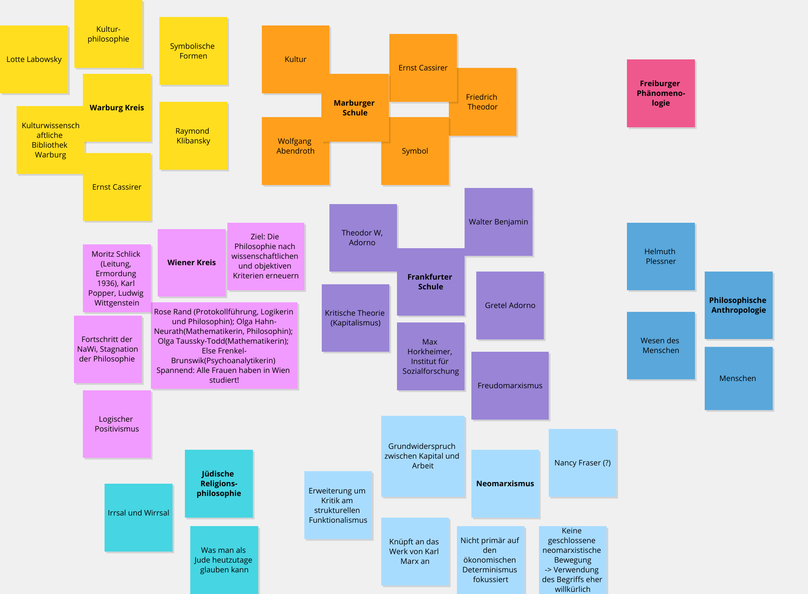
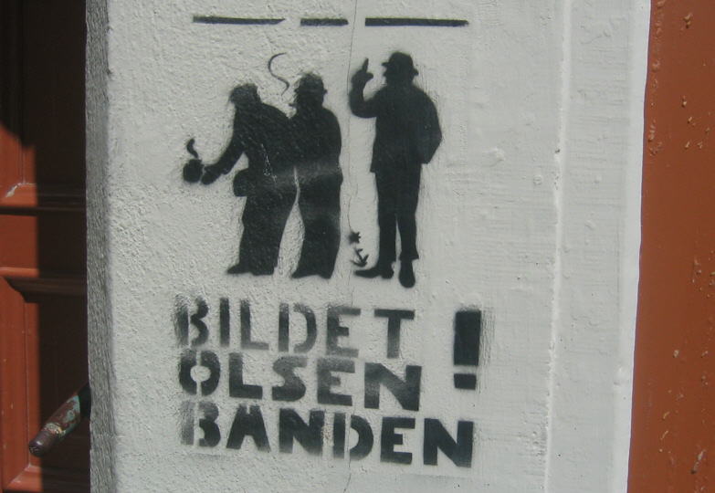
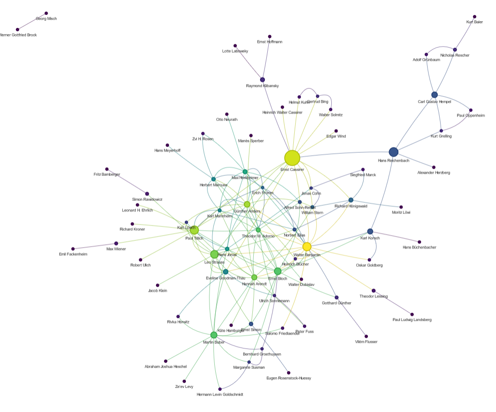

<!--

author: Moritz Riemann, Gregor Große-Bölting
email:  ggb@informatik.uni-kiel.de
version: 0.1
language: en
narrator: UK English Female

-->

# Philosophinnen im Exil

**Dozierende:**

* Moritz Riemann (riemann@philsem.uni-kiel.de)
* Gregor Große-Bölting (ggb@informatik.uni-kiel.de)

**Zeit und Raum:** Di 16:15 - 17:45, CAP4 - R.13.1304a

**Thema:**

Nach wie vor finden Philosophinnen in der akademischen Philosophie nur marginal Beachtung. Dies ist auch darauf zurückzuführen, dass viele Philosophinnen des 20. Jahrhunderts unmittelbar von Vertreibung und Verfolgung durch den Nationalsozialismus betroffen waren: Während wenige, wie Hannah Arendt, trotz dessen internationale Berühmtheit erlangen konnten, werden einige, wie Judith N. Shklar, erst in den letzten Jahren wiederentdeckt; andere sind fast vergessen (z.B. Lotte Labowsky) oder werden kaum als eigenständige Philosophinnen (z.B. Gretel Adorno) wahrgenommen.

In diesem Seminar wollen wir uns interdisziplinär und mit Methoden der digitalen Geisteswissenschaften auf die Suche nach Denkerinnen begeben.

**Inhalte und Vorgehen:**

* Interdisziplinäres Arbeiten: Philosophie- und Informatik-studierende arbeiten zusammen und gewinnen Einblick in das andere Fach
* Einblick in die Digital Humanities und grundlegendes Verständnis digitaler Methoden geisteswissenschaftlicher Arbeit
* Arbeit mit X-Technologien, wie XML TEI, ODD, XSLT und RDF
* Praktische Fähigkeiten im Umgang mit Forschungsdaten und im kollaborativen Arbeiten
* Digitale Analyse- und Visualisierungsmethoden für geistes-wissenschaftliche Fragestellungen
* Erforschung angemessener Formen interdisziplinär-digitaler Wissenschaft und Universität
* Reflexion der eigenen Fachkultur und der Methoden der Informatik bzw. Digital Humanities

## Organisatorisches

### Regierungserklärung

1. Diese Veranstaltung ist eine Forschungs**werkstatt**: Wir setzen neue Methoden und Software ein. Seid also nachsichtig mit uns und mit euch selbst, wenn mal etwas nicht funktioniert wie geplant. Lasst uns zeitnah wissen, wenn ihr Probleme habt, dann findet sich für alles eine Lösung!
2. Das Seminar wird sich voraussichtlich für Philosophiestudierende nicht wie eine Philosophieveranstaltung und für Informatikstudierende nicht wie eine Informatikveranstaltung anfühlen.
3. Ihr dürft (und sollt) gerne eigene Tools und Ideen einbringen! Der Seminarplan ist auch offen für Eure Vorschläge.
4. Interdisziplinarität lebt von wechselseitiger Verständlichkeit: Redet mit uns und mit Euren Mitstudierenden, wenn ihr Dinge nicht versteht oder Hilfe braucht.
5. Wir erwarten von euch, dass ihr euch zwischen den Sitzungen mit den Seminarinhalten befasst (Texte lest, Aufgaben erledigt) und zu den Präsenzsitzungen anwesend seid. Im Gegenzug unterstützen wir euch, wo wir können und machen Zugeständnisse, falls die Arbeitsbelastung zu groß werden sollte. 
6. Der Seminarplan ist "im Fluss".

### Semesterplan

| Datum | Thema/Inhalt |
|-------|--------------|
| 16.04. | Begrüßung, Einführung in das Thema, Überblick über das Semester |
| 23.04. | **I. Philosophiegeschichte.** Hannah Arendts "Wir Flüchtlinge" |
| 30.04. | Philosophie in Deutschland 1920/1930 |
| 07.05. | Paradigmatische Einzelschicksale & Kurztexte, Reflexion und Forschungsfragen |
| 14.05. | **II. Linked Open Data.** Beispiel(e); LOD Cloud, URIs, Triple, RDF |
| 21.05. | Wikidata, DBpedia, SPARQL |
| 28.05. | Karten, Kartendaten und (Web)GIS |
| 04.06. | Präsentation der Zwischenergebnisse, Reflexion |
| 11.06. | Vortrag Maria Robaskiewicz ([History of Women Philosophers and Scientists](https://historyofwomenphilosophers.org/)) |
| 18.06. | **III. Praxisteil / Projektphase.** |
| 25.06. | tba |
| 02.07. | tba |
| 09.07. | *Doppelsitzung:* Abschlusspräsentation |

### Prüfungsleistung

**Für Informatiker_innen:**

* "Sitzungsprotokoll" (20%)
* Peer Review (20%)
* Poster und Posterpräsentation (30%)
* Ausarbeitung (30%)

**Für Philosoph_innen:**

Jede der Prüfungsformen beinhaltet die gemeinsame Präsentation in einer Kleingruppe am Ende des Semesters.

* Referate: bitte frühzeitig melden!
* Essay
* Hausarbeit
* mdl. Prüfung

---

Mögliche Referatsthemen:

* Vorstellung phil. Schulen: Frankfurter Schule, Freiburger Phänomenologie, Warburg Schule, Wiener Kreis, ... 
* Denkerinnenportraits: Simone Weil, Judith N. Shklar, Gretel Adorno, Lotte Labowsky, Margarete Kantorowicz ... 
* ... sprecht uns an!

#### Hinweise zum "Poster" (für alle)

**Aufgabenstellung:** tba

Das Poster wird in der letzten (Doppel-)Sitzung **am 09. Juli 2024** vorgestellt. Dafür stehen jeder Kleingruppe 10 Minuten zur Verfügung ihre Ergebnisse zu präsentieren. Das Zeitlimit ist strikt.

#### Hinweise zu Podcasts (für Philosoph_innen)

Umfangreiche Hinweise zur Erstellung von Podcasts als Prüfungsleistung findet ihr im [folgenden Leitfaden](https://liascript.github.io/course/?https://raw.githubusercontent.com/mauriemann/Podcast/main/Podcast_main.md#24).

#### Hinweise zum "Sitzungsprotokoll" (für Informatiker_innen)

**Aufgabenstellung:** Sprecht mit Gregor eine Sitzung ab, für die ihr ein "Sitzungsprotokoll" anfertigt. Das Protokoll soll die wichtigsten Ergebnisse und Erkenntnisse der Sitzung festhalten (nicht den Verlauf) und dient als Ergänzung bzw. Erweiterung des Kursmaterials, sprich: Die "Protokolle" werden direkt in das Material übernommen und dienen als gemeinsame Ressource für alle zur Nachbereitung des Seminars. Entsprechend sollte das Protokoll so aufbereitet sein, dass ein Nicht-Anwesender Studierender sich anhand der Notizen im Nachhinein ein klares Bild davon machen kann, welche Inhalte in der entsprechenden Woche besprochen wurden. 

Das Protokoll muss bis **spätestens zwei Wochen** nach der Sitzung per E-Mail (ggb@informatik.uni-kiel.de) oder [pull request](https://github.com/ggb/Seminar-Philosophinnen-im-Exil) bei mir eingereicht werden.

Weitere Formalia:

* min. 500 Wörter (etwa eine DIN A4-Seite)
* Das Dokument ist in Markdown abgefasst (noch besser: es verwendet die [LiaScript-Syntax](https://liascript.github.io/course/?https://raw.githubusercontent.com/liaScript/docs/master/README.md#1))
* Falls externe Quellen oder Literatur verwendet wurden, müssen diese gemäß eines üblichen Zitationsstandards (APA, IEEE, ACM, etc.) angegeben werden (bevorzugt: APA)
* Falls ChatGPT o. ä. verwendet wurden: Umfang und Prompts angeben 

Für eine ausreichende (oder bessere) Arbeit

* Besitzt der eingereichte Text eine klare Struktur, die durch Markdown kenntlich gemacht wird
* Wurde eine Rechtschreib- und Grammatikprüfung durchgeführt
* Werden die wichtigsten Themen, Begriffe, etc. der Woche aufgeführt

Eine gute (oder bessere) Arbeit

* Ist verständlich geschrieben und besitzt einen deutlichen, roten Faden
* Bezieht die fachliche Expertise Mitstudierender aus der Philosophie mit ein 
* Nennt und verarbeitet Quellen, die über die Seminarliteratur hinausgehen
* Integriert sich nahtlos in das existierende LiaScript-Material für die Sitzung

#### Hinweise zur Peer Review (für Informatiker_innen)

**Aufgabenstellung:** Euch wird am Tag der Posterpräsentation eine andere Gruppe zugewiesen. Schreibt eine kurze "Kritik" des vorgestellten Posters. Diese Kritik sollte in der Tendenz positiv, wertschätzend und konstruktiv sein, d.h. Möglichkeiten der Verbesserung aufzeigen. Versucht dafür nachvollziehbare Kriterien der Bewertung zu finden. Berücksichtigt sowohl den Vortrag, wie auch das erstellte "Poster". Die Peer Review sollte die Möglichkeit bieten die kritisierten Punkte in der Ausarbeitung zu berücksichtigen.

Das Protokoll ist **bis spätestens zum 31. Juli 2024** per E-Mail (ggb@informatik.uni-kiel.de) bei mir als PDF einzureichen.

Weitere Formalia:

* 300 Wörter (+/- 20%), etwas weniger als eine DIN A4-Seite. Bitte gebt die Anzahl der Wörter am Ende des Dokuments an.
* Name, stu-Mailadresse
* Unterschriebene Eigenständigkeitserklärung
* Falls externe Quellen oder Literatur verwendet wurden, müssen diese gemäß eines üblichen Zitationsstandards (APA, IEEE, ACM, etc.) angegeben werden
* Falls ChatGPT o. ä. verwendet wurden: Umfang und Prompts angeben (ich rate von der Verwendung ab, da es sich um eine Reflexion der eigenen Erfahrungen mit dem Tool handeln soll)

Für eine ausreichende (oder bessere) Arbeit

* Besitzt der eingereichte Text eine klare Struktur
* Wurde eine Rechtschreib- und Grammatikprüfung durchgeführt
* Der Text wertschätzend und konstruktiv verfasst
* Ein "problematischer" Aspekt der Posterpräsentation identifziert

Eine gute (oder bessere) Arbeit

* Ist verständlich geschrieben und besitzt einen deutlichen, roten Faden
* Mehrere verbesserungswürdie Aspekte der Posterpräsentation identiziert
* Lösungsmöglichkeiten für die Aspekte benannt

#### Hinweise zur Ausarbeitung (für Informatiker_innen)

**Aufgabenstellung:** tba

Die Ausarbeitung kann bis zum **30. September 2024** (Ende des Semesters) per E-Mail (ggb@informatik.uni-kiel.de) bei mir als PDF eingereicht werden.

Weitere Formalia:

* 1500 Wörter im einspaltigen [ACM-Template](https://www.acm.org/publications/proceedings-template), bevorzugt in LaTeX ([Overleaf](https://www.rz.uni-kiel.de/de/angebote/software/overleaf/overleaf))
* Name, stu-Mailadresse
* Unterschriebene Eigenständigkeitserklärung
* Externe Quellen sind gemäß der ACM-Zitierweise anzugeben; das Literaturverzeichnis zählt nicht zur Gesamtlänge
* Falls ChatGPT o. ä. verwendet wurden: Umfang und Prompts angeben (zählt nicht zur Gesamtlänge)
* Die Arbeit kann auf Deutsch oder Englisch verfasst werden

Für eine ausreichende (oder bessere) Arbeit

* Besitzt der eingereichte Text eine klare Struktur
* Ist verständlich geschrieben und besitzt einen deutlichen, roten Faden
* Wurde eine Rechtschreib- und Grammatikprüfung durchgeführt
* Baut auf den Diskussionen und Ergebnissen des Seminars und/oder der Posterpräsentation auf
* Reflektiert das eigene Vorgehen und zeigt Vor- und Nachteile auf

Eine gute (oder bessere) Arbeit

* Leistet einen Beitrag, der erkennbar über die Ergebnisse des Seminars und/oder der Posterpräsentation hinausgeht
* Bezieht Literatur ein, die über das hinausgeht, was im Seminar erwähnt/verwendet wurde
* Zeigt ein hohes und kritisches Verständnis der vewendeten Methoden
* Reflektiert den informatischen und philosophischen (natürlich weniger umfangreich) Beitrag für die Digital Humanities

## Sitzung am 16.04. 

### "Speed Dating"

Sprecht mit der Person, die euch gegenübersitzt, zwei Minuten über die folgenden Fragen:

1. Warum studiert Ihr Eure Disziplin?
2. Was bewundert Ihr an der jeweils anderen Disziplin?
3. Welche einflussreichen Frauen (Philosophinnen, Informatikerinnen) kennt ihr in eurer Disziplin?

Wenn das Signal gegeben wird, rücken diejenigen, die mit dem Gesicht zum Eingang/Front sitzen, einen Platz nach links.

Diejenigen die außen sitzen wechseln die Reihe und füllen den leeren Platz in der nächsten Reihe auf usw.

### Wie liest man philosophische Texte?

Philosophische Texte sollten bzw. können nicht wie andere Texte gelesen werden: Sie müssen eingeordnet und verstanden werden, das Textverständnis erfordert eine aktive Auseinandersetzung. Rosenberg (1984) macht sechs verschiedene Vorschläge, wie man eine:n Philosoph:in lesen kann:

>1. Sie können einen Philosophen auf seine Resultate hin lesen 
>2. Sie können einen Philosophen auf seine Argumente hin lesen 
>3. Sie können einen Philosophen in seinem dialektischen Zusammenhang lesen 
>4. Sie können einen Philosophen kritisch lesen
>5. Sie können einen Philosophen auf die Entscheidung eines Problems hin lesen
>6. Sie können einen Philosophen kreativ lesen 
>
> (Rosenberg, 1984)

Der vollständige Text mit einer Erläuterung, was es mit den einzelnen Thesen auf sich hat, findet sich im [OLAT-Materialverzeichnis](https://lms.uni-kiel.de/url/RepositoryEntry/5455183961/CourseNode/109271451133388/path%3D~~Texte~~Jay%20F%2E%20Rosenberg%5F%20Sechs%20Moglichkeiten%5F%20einen%20Text%20zu%20lesen%2Epdf/0). 

#### Wie liest man Hannah Arendts "Wir Flüchtlinge"?

Hannah Arendts kurzer Essay erschien 1943 mit dem englischen Titel "We refugees" im jüdischen Menorah Journal. Der Text wurde von der Forschung lange Zeit ignoriert, und erst 1986 erschien die erste deutsche Übersetzung von Marie-Louise Knott in der Aufsatzsammlung *Zur Zeit*, das Menorah Journal war bereits 1962 als Zeitschrift eingestellt worden.

Der Text gilt als einer der ersten philosophischen Essays zur Situation jüdischer Flüchtlinge in den USA, der bereits im Wissen der Welt um die nationalsozialistischen Konzentrations- und Vernichtungslager entstand. Der englische Titel *We Refugees* kann dabei als die negative Emphase von [*We, the People*](https://de.wikipedia.org/wiki/We_the_People) gelesen werden, als das Gegenteil der Ermöglichung von Freiheit und eine Juxtaposition von Flüchtlingen und Staatenlosen auf der einen, sowie den ausgrenzenden und aufnehmenden Staaten auf der anderen Seite. Diese Gegenüberstellung unterstreicht in Arendts Denken die Inkongruenz von Menschenrechten und Bürgerrechten, die sie in verschiedenen Textstücken und Kontexten problematisiert und schließlich als die zentrale Aporie der Menschenrechte identifiziert. Denn das Recht, Rechte zu haben, welches Arendt seit 1948 als das einzige Menschenrecht identifiziert, postuliert und problematisiert die universale Geltung von Menschenrechten zugleich.

Lest den Text aufmerksam auf folgende Fragen hin:

1. Warum meint Arendt, dass niemand "Flüchtling" genannt werden will? 
2. Welche Elemente [intersektionaler](https://de.wikipedia.org/wiki/Intersektionalit%C3%A4t) Diskriminierung der jüdischen Flüchtlinge lassen sich in Arendts Beschreibungen finden?
3. Gibt es Hinweise darauf, ob die Situation intellektueller Geflüchteter besonders ist? Sucht nach spezifischen Herausforderungen, Verlusten, Gefahren. Achtet dabei auch auf die Perspektive, aus der Arendt den Text schreibt.
4. Was hat es mit den Begriffen Parvenü, Paria und Avantgarde auf sich? 

### Zur nächsten Sitzung

Lest die beiden folgenden Texte:

* Schäfer, H. (2023). Hannah Arendt in New York. Philosophie Magazin, 4, 32–39.
* Arendt, H. (1989). Wir Flüchtlinge. In: Arendt, H. Zur Zeit. Politische Essays. dtv, 7-23.

## Protokoll und Aufbereitung der Sitzung vom 23.04.

(von **Nils Nicklaus**)

Dieses Protokoll bereitet die Inhalte der Sitzung vom 23.04.2024 nach. Es werden die im Plenum vorgestellten Erkenntnisse geordnet zusammengefasst und an passenden Stellen mit zusätzlichen Quellen, welche als solche gekennzeichnet sind, ergänzt.

**Zweck und Überblick der Sitzung**

An diesem Seminar-Termin haben wir versucht, die Lebensrealität verfolgter Denkerinnen und Denker zu Zeiten kurz vor und während des Nationalsozialismus in einen philosophiehistorischen Kontext zu setzen. Hierfür wurde exemplarisch die Fluchtgeschichte von Hannah Arendt betrachtet und der, 1943 von ihr verfasste, Text **Wir Flüchtlinge** als Zeitdokument unter bestimmten Gesichtspunkten diskutiert.

### Geschichtlicher Kontext
Hierfür wurden 3 Fragen im Plenum diskutiert:

1. Wie war die politische Situation in Europa in den 20er/30er Jahren des 20. Jahrhunderts?

    * In den 20er Jahren herrscht in Europa nach dem 1. Weltkrieg Kriegsmüdigkeit.
    * Es beginnt die Dekolonialisierung.
    * Allgemein gibt es Konfliktpotenzial aufgrund unterschiedlicher Ideologien.
    * Der Adel verliert in weiten Teilen Europas an Macht und Einfluss.
    * Deutschland hat nach der Kapitulation die im Versailler Vertrag festgehaltene Verantwortung und die 1921 von den Alliierten bestimmten Reparationszahlungen für den 1. Weltkrieg zu tragen.

        > Die alliierten und assoziierten Regierungen erklären, und Deutschland erkennt an, daß [sic!] Deutschland und seine Verbündeten als Urheber für alle Verluste und Schäden verantwortlich sind, die die alliierten und assoziierten Regierungen und ihre Staatsangehörigen infolge des ihnen durch den Angriff Deutschlands und seiner Verbündeten aufgezwungenen Krieges erlitten haben (Vertrag von Versailles, 1919, Artikel 231).

    * Der vorherige Punkt sowie die Weltwirtschaftskrise führen zu einer gesellschaftlich angespannten Situation in der jungen Weimarer Republik.
    * Auf den Straßenterror und die Propaganda der Nationalsozialisten folgt dann mit der Ernennung von Adolf Hitler zum Reichskanzler am 30. Januar 1933 die Machtübernahme der NSDAP (Deutscher Bundestag, o.D.).
    * Italien steht unter der Herrschaft des faschistischen Diktators Mussolini.
    * In Russland wird nach dem Ende der Zarenherrschaft 1922 die Sowjetunion gegründet.
    * In Frankreich soll es, laut eines Beitrags aus dem Plenum, in den 30er Jahren nur noch eine *Marionettenregierung* gegeben haben, welche in weiten Teilen, auch bei der Auslieferung von Geflüchteten Jüdinnen und Juden, mit Deutschland kooperiert haben soll.  
    Die zeitliche Einordnung war hier jedoch fehlerhaft. Bei der angesprochenen Regierung handelt es sich um das **Vichy-Regime**, welches am 10. Juli 1940 nach der weiträumigen Besatzung Frankreichs durch Deutschland begründet wurde. Damit wurde die vorherige französische Verfassung faktisch außer Kraft gesetzt (Prauser, 2013).

2. Warum mussten Personen (aus Nazi-Deutschland) fliehen? Welche Personengruppen waren besonders von Ausgrenzung, Verfolgung und Vernichtung betroffen?

    * Personen fliehen, um der Verfolgung und der möglichen anschließenden Deportation in Konzentrations- und Vernichtungslager der Nationalsozialisten zu entkommen.
    * Dies betrifft besonders Bevölkerungsgruppen, welche aufgrund der ideologischen nationalsozialistischen Rassenlehre vom Großteil der deutschen Bevölkerung als minderwertig angesehen und behandelt, sowie Menschen mit politischen Ansichten, die vom Nazi-Regime als Bedrohung angesehen werden.
    * Folgende Personengruppen wurden im Plenum gesondert erwähnt:

        * Sinti und Roma

        * Jüdinnen und Juden

        * Arbeitsunfähige

        * Menschen mit Behinderung

        * Oppositionelle

        * Lehrpersonal, welches nicht nach den Vorgaben der NS-Ideologie lehrt

        * Homosexuelle Menschen

        * Künstler:innen, welche laut NS-Ideologie *entartete Kunst* praktizieren

        * Anhänger:innen von Glaubensgemeinschaften, welche durch die NS-Ideologie nicht geduldet sind.

3. Wie "floh" man, d. h. was hieß Flucht ganz praktisch? Welche Länder boten sich für die Flucht an? Welche Hindernisse gab es?

    * Mögliche Fluchtziele sind beispielsweise: die USA, Großbritannien, Frankreich oder die Niederlande.
    * Allgemein versuchen Flüchtende, sofern möglich, in Nachbarländer zu gelangen, in denen sie Verwandte haben.
    * Zuerst wird versucht, nahegelegene Länder aufzusuchen, jedoch flüchten nach Kriegsausbruch immer mehr Menschen in weiter entfernte Länder wie die USA.

        > Zwischen der Machtübernahme der Nationalsozialisten im Jahr 1933 und der Kapitulation Deutschlands 1945 wanderten mehr als 340.000 Juden aus Deutschland und Österreich aus. Tragischerweise fanden fast 100.000 von ihnen Zuflucht in Ländern, die später von Deutschland besetzt wurden (United States Holocaust Memorial Museum, 2021).

    * Die Flucht ist teuer und wird zudem durch einen hohen bürokratischen Aufwand bei der Aus- und Einreise mittels Visa erschwert.
    * Reisepässe deutscher Jüdinnen und Juden werden 1938 als ungültig erklärt und erlangten erst wieder ihre Gültigkeit, sobald sie mit einem roten **J** gekennzeichnet werden.
    * Es gibt zu der Zeit keine allgemein anerkannten bzw. durchgesetzten Abkommen über die Rechtsstellung von Geflüchteten.

### Hannah Arendts und Heinrich Blüchers (Flucht-)Route aus Deutschland

Die unten stehende Karte zeigt die Fluchtroute von Hannah Arendt (blau) und Heinrich Blücher(rot).  
Thematisiert wurde hauptsächlich die Zeit von Hannah Arendt im Internierungslager *Camp de Gurs*.

Zur Zeit des deutschen Angriffs auf Frankreich werden dort nach französischer Bezeichnung *feindliche Ausländer* festgehalten, bei denen es sich zu dieser Zeit ausschließlich um Frauen und Kinder handelt, welche aus Deutschland und Österreich geflohen sind. Zu Höchstzeiten waren dort 9.771 Menschen inhaftiert. Nach der Unterzeichnung des Waffenstillstandes zwischen Deutschland und Frankreich im Juni 1940 wurde das Lager zeitweise aufgrund ungeklärter Zuständigkeiten geöffnet (Gerlach & Weber, 2005). Dadurch konnten viele Menschen entkommen, darunter auch Hannah Arendt.

<iframe width="100%" height="600px" frameborder="0" allowfullscreen allow="geolocation" src="https://umap.openstreetmap.fr/en/map/hannah-arendts-fluchtroute-von-berlin-nach-new-yor_977287?scaleControl=false&miniMap=false&scrollWheelZoom=false&zoomControl=true&editMode=disabled&moreControl=true&searchControl=null&tilelayersControl=null&embedControl=null&datalayersControl=true&onLoadPanel=undefined&captionBar=false&captionMenus=true"></iframe>
<a href="https://umap.openstreetmap.fr/en/map/hannah-arendts-fluchtroute-von-berlin-nach-new-yor_977287?scaleControl=false&miniMap=false&scrollWheelZoom=true&zoomControl=true&editMode=disabled&moreControl=true&searchControl=null&tilelayersControl=null&embedControl=null&datalayersControl=true&onLoadPanel=undefined&captionBar=false&captionMenus=true">See full screen</a>

### Hannah Arendts "Wir Flüchtlinge"

Vorbereitend war Hannah Arendts Text *Wir Flüchtlinge* zu lesen und es wurden zunächst in kleinen Gruppen und dann im Plenum folgende Fragen diskutiert.

Zur Einordnung: Beim Erscheinen dieses Textes waren die, durch die Deutschen begangenen Taten in Auschwitz bereits öffentlich geworden, und Arendts Text gilt als erstes philosophisches Schriftstück, welches sich damit auseinandersetzt.

1. Warum meint Arendt, dass niemand "Flüchtling" genannt werden will?

    * Begriff Flüchtling beschreibt Menschen, die einen Grund haben, zu flüchten und ist damit negativ konnotiert.
    * Damit versucht sie abzugrenzen zwischen Menschen, die aufgrund der eigenen Handlungen fliehen mussten und den Jüdinnen und Juden, denn die Jüdinnen und Juden wurden wegen ihrer bloßen Existenz verfolgt.
    * In dem historischen Kontext wird Flüchtling schnell mit der Zugehörigkeit zum Judentum verknüpft.
    * Nach Arendt wären Bezeichnungen wie Neuankömmlinge und Einwanderer besser geeignete Begriffe.

2. Welche Elemente [intersektionaler](https://de.wikipedia.org/wiki/Intersektionalit%C3%A4t) Diskriminierung der jüdischen Flüchtlinge lassen sich in Arendts Beschreibungen finden?

    * Gewisse Stigmata, wie die als Schnorrer.
    * Die Jüdische Bevölkerung aus Polen wird negativer betrachtet als die aus Frankreich.
    * Betrachtung der Geflüchteten als *feindliche Ausländer* anstelle von künftigen Staatsbürgerinnen und Staatsbürgern.
    * Diskriminierung auf den Ebenen der Rassifizierung, Religion und Nationalität.

3. Gibt es Hinweise darauf, ob die Situation intellektueller Geflüchteter besonders ist? Sucht nach spezifischen Herausforderungen, Verlusten, Gefahren. Achtet dabei auch auf die Perspektive, aus der Arendt den Text schreibt.

    * Die Sprachbarriere stellt eine größere Herausforderung dar, da die Sprache als Werkzeug schwieriger zu nutzen und teilweise neu zu erlernen ist.
    * Intellektuelle sind schneller in den Fokus der Nationalsozialisten geraten, da die Fähigkeit des Ausdrucks als eine potentielle Gefahr gegen das Regime betrachtet wurde.

4. Was hat es mit den Begriffen Parvenü, Paria und Avantgarde auf sich?

    * **Parvenü**: Hier beschreibt Arendt geflüchtete Jüdinnen und Juden, die sich bei der Ankunft in einem neuen Land ihre eigene Identität verleugnen und versuchen zu assimilieren, jedoch trotzdem nicht anerkannt werden.
    
    * **Paria**: Hiermit drückt Arendt den Widerstand der Assimilation und das Treu-bleiben des eigenen Selbst aus, welches verhindert in die Gesellschaft integriert zu werden und nur einen Blick von außen gewährt.
    
    * **Avantgarde**: Nach Arendt repräsentieren die von einem Land ins andere vertriebenen Flüchtlinge die Avantgarde ihrer Völker. So gibt der Zustand alles verloren zu haben die Möglichkeit, sich noch als jüdisch zu identifizieren.

### Quellenverzeichnis

Deutscher Bundestag. (o.D.). *Machtübernahme der Nationalsozialisten*. Abgerufen am 27.04.2024, von https://www.bundestag.de/besuche/ausstellungen/verfassung/tafel22/tafel22-199844

Gerlach, S. & Weber, F. (2005). *"...es geschah am helllichten Tag!" Die Deportation der badischen,pfälzer und saarländischen Juden in das Lager Gurs/Pyrenäen* (4. Rev. ed.). Landeszentrale für politische Bildung Baden-Württemberg. https://www.lpb-bw.de/publikationen/helllichten/helllichten_05.pdf

Prauser, S. (2013, Januar 21). *Erinnerungen an eine dunkle Zeit: Kollaboration und Widerstand in Frankreich*. Bundeszentrale für politische Bildung. https://www.bpb.de/themen/europa/frankreich/152983/erinnerungen-an-eine-dunkle-zeit-kollaboration-und-widerstand-in-frankreich/#node-content-title-0

United States Holocaust Memorial Museum. (2013, März 22). *Flüchtlinge*. https://encyclopedia.ushmm.org/content/de/article/refugees

Versailler Vertrag. (1919, Juni 28). *Versailler Vertrag*. https://www.versailler-vertrag.de/vv-i.htm

### Zur nächsten Sitzung

Lest den folgenden Text:

* Benhabib, S. (2018). Intertwined Lives and Themes among Jewish Exiles. In: Benhabib, S. Exile, Statelessness, and Migration. Princeton University Press, 1-8.

Informiert euch (Wikipedia, Stanford Encyclopedia of Philosophy) über eine der folgenden philosophischen Schulen, die in den 20er bzw. 30er Jahren in Deutschland existierten:

* Warburg Schule (Aby Warburg, Ernst Cassirer)
* Marburger Schule bzw. Neukantianismus (Cohen, Hartmann)
* Freiburger Phänomenologie (Husserl, Heidegger)
* Wiener Kreis/Logischer Positivismus (Carnap, Schlick, Popper, Wittgenstein)
* Frankfurter Schule/Kritische Theorie (Adorno, Horkheimer, Tillich)
* Philosophische Anthropologie (Gehlen, Plessner)
* Jüdische Religionsphilosophie (Martin Buber, Franz Rosenzweig, Gershom Sholem)
* Neomarxismus (Ernst Bloch, Georg Lukács, Walter Benjamin)

Nehmt dabei vor allem die folgenden Fragestellungen in den Blick:

* Welche (weiteren) wichtigen Person gehören zu der jeweiligen Schule? Findet min. eine Frau!
* Was sind die wichtigsten Positionen?

## Sitzung am 30.04.

### Philosophische Schulen im Deutschland der 20er und 30er Jahre

Sammelt auf dem folgenden Conceptboard die Ergebnisse eurer Recherchen!

[https://app.conceptboard.com/board/tozr-ipt1-4ybh-tnrf-919a](https://app.conceptboard.com/board/tozr-ipt1-4ybh-tnrf-919a)

#### Ergebnis

### Referat "Der Warbug Kreis"

(Referenten: Frederike Kahler, Philipp Fürst)

Aby M. Warburg

* Überlassung d. Erstgeborenenrechts; lebenslange Bücherzufuhr
* Kunsthistoriker Studium
* Großes Interesse an anderen Disziplinen

Kulturwissenschaftliche Bibliothek (KBW)

* Ziel: Gelehrte in Hamburg zusammenbringen
* Wissenschaft fördern
* Öffnung 1905
* Umfang: 60.000 Werke
* 1933 Umsiedelung nach London
* Vier Abteilungen

Universität Hamburg

* Gründung 1919
* Ziel: Merkantilismus, nicht öffentlicher Dienst und Weltoffen, nicht nur national konservativ

Der Warburg Kreis

* Bibliothek und Universität lockt Intellektuelle
* Interdisziplinärer Kreis mit Willen zur Zusammenarbeit
* Manchmal auch Hamburger Schule

Die erste Kulturwissenschaft

* Mitglieder überschneiden sich mit Warburg Kreis
* Erweiterung des Suchtfeldes Deutschland und Europas
* Arbeiten an Übergängen zwischen den Disziplinen

Nachleben

* Flucht aus Deutschland (Mitglieder sowie Bibliothek)
* Arbeiten gingen verloren; Autor:innen wurden vergessen

Gertrud Bing

* Philosophie, Literaturgeschichte und Psychologie Studium in München/Hamburg
* Promotion unter Ernst Cassirer
* Bibliothekarin der KBW
* 1924 pers. Assistentin Aby M. Warburgs
* Lebensprojekte

    * Bibliographie Warburgs (Projekt blieb unvollendet)

    * Fragment sur Aby Warburg

Ernst Cassirer

* Literatur und Philosophie Studium
* Ab 1896 in Marburg

    * Neukantianer

* 1919 – 1933 Professor für Philosophie in Hamburg
* Dreibändiges Hauptwerk Philosophie der symbolischen Formen
* Erster jüdischer Rektor an einer deutschen Uni
* Flucht nach England; später Schweden und dann in die USA

Symbolic Forms

* Erst ab 1919 durch Berufung 
* Intensive Beschäftigung eines Kulturbegriffs
* 1922 erste Publikation; „fundamentale geistige Aktivität
* Gemeinsam mit Warburg
* 1923 erster Teil „Sprache“
* Symbolbegriff auch nach Pierce und de Saussure
* Mensch als Wesen in vielfältigen Netzen von Symbolen
* Symbolsystem
* Mensch als „animal symbolicum“
* Drei Funktionen

    * Ausdrucksfunktion

    * Darstellungsfunktion
    
    * Bedeutungsfunktion

Lotte Labowsky

* Deutsch-jüdische-Philosophin und Altphilologin
* Klassische Philologie in München/Heidelberg
* 1932 Promotion
* Ab 1933 in Projekte der KBW einbezogen
* Zweitstudium: Griechisch und Paläografie
* 1936 begrenzte Arbeitserlaubnis

Raymond Klibansky

* 1914 nach Deutschland
* Student in Heidelberg
* Arbeitsbeziehung mit Warburg und Cassirer
* Schneller Akademischer Ruhm
* Gründung des internationalen Instituts für Philosophie
* Berufung nach Montreal
* Ehrensenator

Labowsky & Klibansky

* Freundschaft bereits während Studiums
* Gleiche Forschung: Plato-Rezeption in Mittelalter und Renaissance
* Gemeinsam ins Exil mit Bibliothek
* Editionsprojekt Corpus Platonicum Medii Aevi
* Briefwechsel nach Berufung Klibanskys

### Referat "Frankfurter Schule"

Weitere Informationen folgen...

## Sitzung am 07.05.

### Organisation von Wissen

>Wie organisiert Ihr Euer Wissen, bspw. Bücher, Artikel, Dateien, Notizen, etc.?
>
>Welchen Einfluss hat die Organisation von Wissen auf die Generierung von neuen Einsichten und Erkenntnissen?

#### Tools, die in der Diskussion erwähnt wurden

Literaturverwaltungssoftware:

* [Citavi](https://www.citavi.com/de) (kommerzielles Programm, die Uni Kiel stellt Studierenden eine [kostenfreie Lizenz zur Verfügung](https://www.rz.uni-kiel.de/de/angebote/software/citavi/citavi))
* [Zotero](https://www.zotero.org/) (gute freie Alternative)
* [Jabref](https://www.jabref.org/) (besonders gut für die Arbeit in den Naturwissenschaften und der Informatik geeignet)

Software für das Anlegen von digitalen Zettelkästen bzw. die Organisation von Notizen:

* [Obisidian](https://obsidian.md/)
* [Zettlr](https://www.zettlr.com/)

### Referat "Gretel Adorno"

Weitere Informationen folgen...

### Was macht eine:n Philosoph:in aus?

>Ist Gretel Adorno eine Philosophin?
>
>Was macht eine Person zu einem:einer Philosoph:in?

### Referat "Edith Stein"

Weitere Informationen folgen...

### Zur nächsten Sitzung

Lest den folgenden Artikel:

* Jonathan Blaney, "Introduction to the Principles of Linked Open Data," Programming Historian 6 (2017), [https://doi.org/10.46430/phen0068](https://doi.org/10.46430/phen0068).

Betrachtet anschließend die Informationen Hannah Arendts in der Wikipedia, der DBpedia, bei Wikidata und in der GND:

* https://en.wikipedia.org/wiki/Hannah_Arendt
* https://dbpedia.org/page/Hannah_Arendt
* https://www.wikidata.org/wiki/Q60025
* https://explore.gnd.network/gnd/11850391X?term=Hannah%20Arendt

Versucht die Darstellungsform der Daten über Arendt in Verbindung mit dem Artikel zu bringen. Welche Möglichkeiten könnten sich eröffnen?

## Sitzung am 14.05.

### Bildet Kleingruppen!

> Bildet Kleingruppen mit 2 bis 4 Teilnehmer:innen. Jede Kleingruppe *muss* mindestens eine:n Philosophie- und Informatikstudierenden beinhalten.
>
> Stellt euch einander vor.
> 
> Jede Kleingruppe bearbeitet eine der nachfolgenden Fragengruppen und beantwortet die darin enthaltenen Fragen in Bezug auf die Datenbankeinträge über Hannah Arendt (s. letzte Sitzung). Alle Kleingruppen sollten eine kurze Präsentation vorbereiten, um die Antworten auf ihre Fragen dem Plenum zu präsentieren. Die Form ist dabei den Gruppen überlassen.
>
> Ihr habt dafür insgesamt 25 Minuten Zeit.

### Was ist 'Linked Data'?

Gruppe 1: Allgemeines

* Was bedeutet "offen" im Zusammenhang mit *linked open data*? Warum ist Offenheit erstrebenswert?
* Was hat es mit der Eindeutigkeit von Einträgen in *linked data* auf sich? Was soll eindeutig sein?
* Was ist ein Tripel? Welche Rolle kommt Tripeln zu?

Gruppe 2: Uniform Resource Identifier (URI)

* Was ist eine URI? Wie unterscheiden sich URIs von URLs?
* Welche Rolle spielt bzgl. der Eindeutigkeit von URIs das *domain name system* (DNS)?
* Wozu werden URIs in *linked data* verwendet/benötigt?
* Was bedeutet Dereferenzierung (*dereferenciation*)?

Gruppe 3: Ontologien

* Was ist (im Zusammenhang mit *linked data*) eine Ontologie?
* Wie werden Ontologien im *linked data*-Kontext eingesetzt?
* Wie unterscheiden sich Ontologien von Taxonomien?
* Was ist ein Vokabular, was ist ein Schema?

Gruppe 4: RDF und Datenformate

* Was heißt "Serialisierung" (*serialisation*)?
* Was ist Turtle? Wie ist Turtle aufgebaut?
* Was sind *prefixes* und wozu werden sie benötigt?
* In welchem Verhältnis steht RDF zu RDF/XML und RDF zu Turtle?

(optional) Gruppe 5: SPARQL

* Was kann SPARQL? Wozu wird es benötigt?
* Wie ist eine SPARQL-Anfrage aufgebaut? Was bedeuten Wörter mit einem "?" am Anfang?
* Was für SPARQL-Anfragen könnten im Zusammenhang mit Exilphilosophinnen interessant sein?

### Warum 'Linked Data'?

[Exiled Philosophers](https://exiled-philosophers.streamlit.app/)

### Zur nächsten Sitzung

Lest den folgenden Artikel:

* Matthew Lincoln, "Using SPARQL to access Linked Open Data," Programming Historian 4 (2015), <https://doi.org/10.46430/phen0047>.

und/oder schaut das folgende Video:

<iframe width="560" height="315" src="https://www.youtube.com/embed/kJph4q0Im98?si=pW6w69zukq7jQEAO" title="YouTube video player" frameborder="0" allow="accelerometer; autoplay; clipboard-write; encrypted-media; gyroscope; picture-in-picture; web-share" referrerpolicy="strict-origin-when-cross-origin" allowfullscreen></iframe>

## Sitzung am 21.05.

