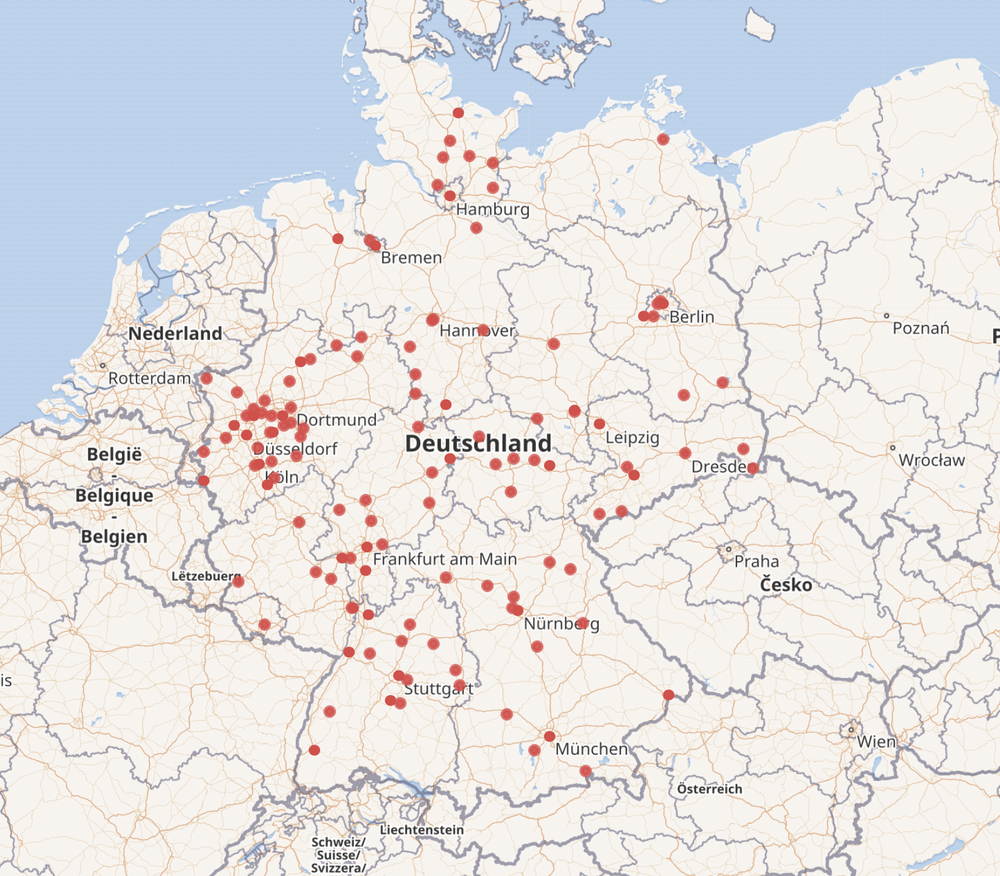
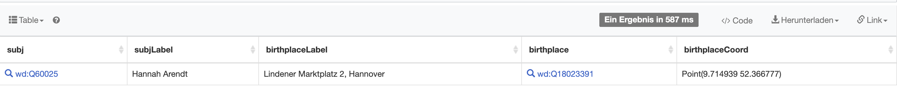
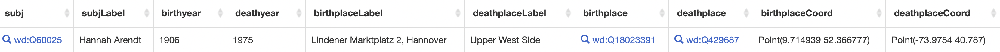
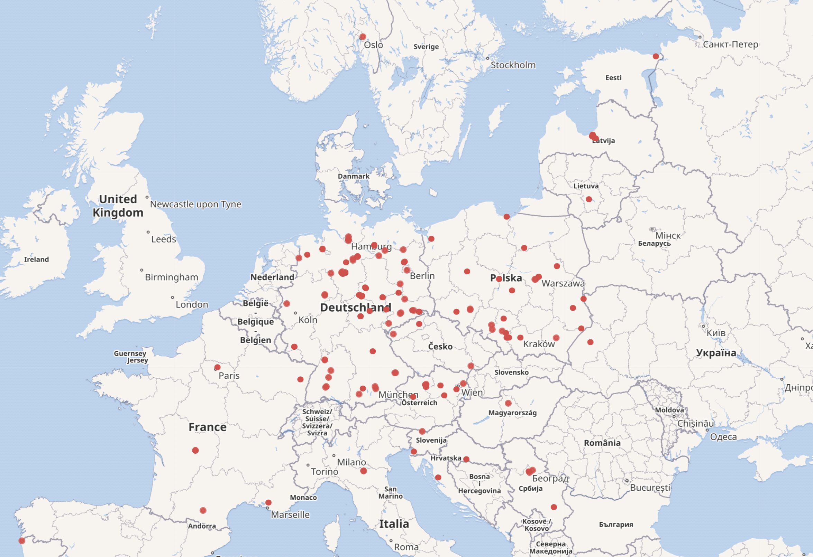
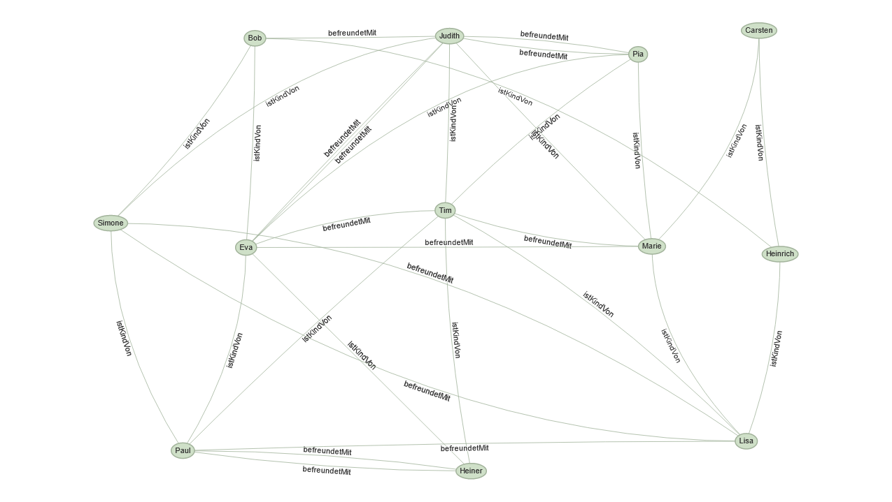
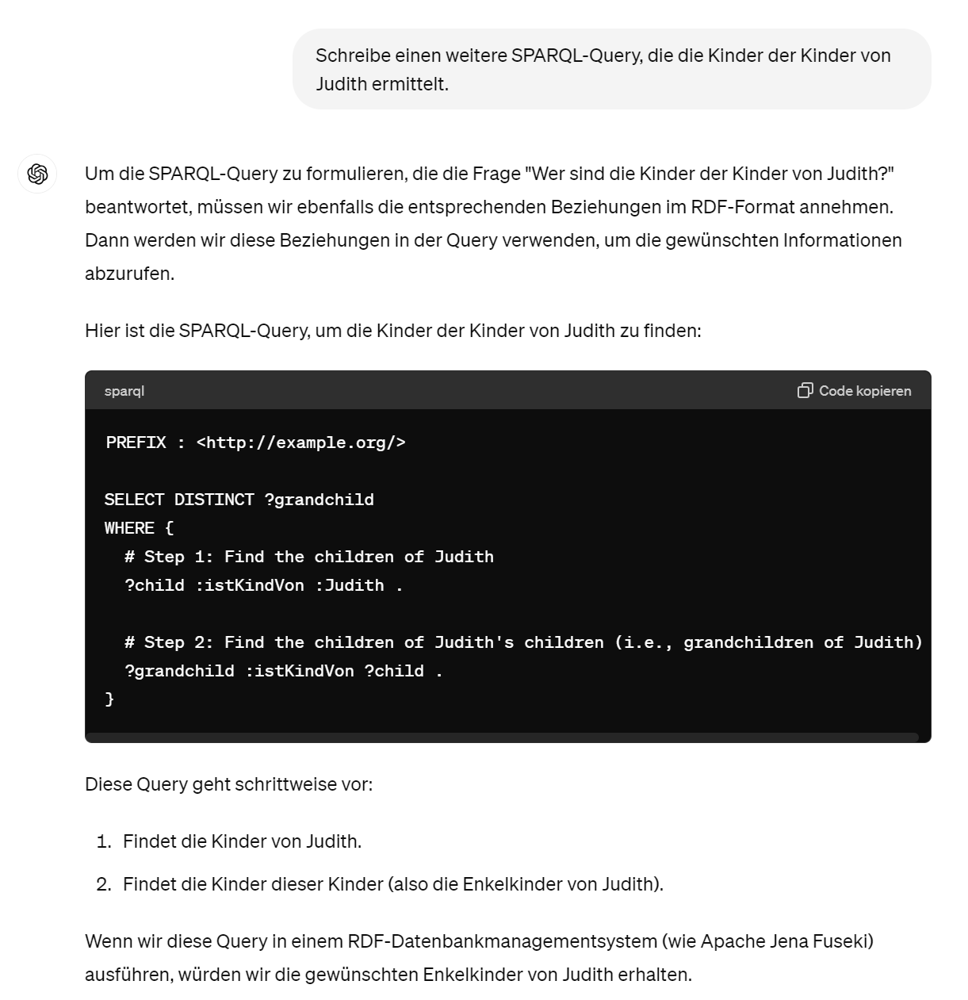

<!--

author: Moritz Riemann, Gregor Große-Bölting
email:  ggb@informatik.uni-kiel.de
version: 0.1
language: en
narrator: UK English Female

-->

# Philosophinnen im Exil

**Dozierende:**

* Moritz Riemann (riemann@philsem.uni-kiel.de)
* Gregor Große-Bölting (ggb@informatik.uni-kiel.de)

**Zeit und Raum:** Di 16:15 - 17:45, CAP4 - R.13.1304a


**Thema:**

Nach wie vor finden Philosophinnen in der akademischen Philosophie nur marginal Beachtung. Dies ist auch darauf zurückzuführen, dass viele Philosophinnen des 20. Jahrhunderts unmittelbar von Vertreibung und Verfolgung durch den Nationalsozialismus betroffen waren: Während wenige, wie Hannah Arendt, trotz dessen internationale Berühmtheit erlangen konnten, werden einige, wie Judith N. Shklar, erst in den letzten Jahren wiederentdeckt; andere sind fast vergessen (z.B. Lotte Labowsky) oder werden kaum als eigenständige Philosophinnen (z.B. Gretel Adorno) wahrgenommen.

In diesem Seminar wollen wir uns interdisziplinär und mit Methoden der digitalen Geisteswissenschaften auf die Suche nach Denkerinnen begeben.

**Inhalte und Vorgehen:**

* Interdisziplinäres Arbeiten: Philosophie- und Informatik-studierende arbeiten zusammen und gewinnen Einblick in das andere Fach
* Einblick in die Digital Humanities und grundlegendes Verständnis digitaler Methoden geisteswissenschaftlicher Arbeit
* Arbeit mit X-Technologien, wie XML TEI, ODD, XSLT und RDF
* Praktische Fähigkeiten im Umgang mit Forschungsdaten und im kollaborativen Arbeiten
* Digitale Analyse- und Visualisierungsmethoden für geistes-wissenschaftliche Fragestellungen
* Erforschung angemessener Formen interdisziplinär-digitaler Wissenschaft und Universität
* Reflexion der eigenen Fachkultur und der Methoden der Informatik bzw. Digital Humanities

## Organisatorisches

### Regierungserklärung

1. Diese Veranstaltung ist eine Forschungs**werkstatt**: Wir setzen neue Methoden und Software ein. Seid also nachsichtig mit uns und mit euch selbst, wenn mal etwas nicht funktioniert wie geplant. Lasst uns zeitnah wissen, wenn ihr Probleme habt, dann findet sich für alles eine Lösung!
2. Das Seminar wird sich voraussichtlich für Philosophiestudierende nicht wie eine Philosophieveranstaltung und für Informatikstudierende nicht wie eine Informatikveranstaltung anfühlen.
3. Ihr dürft (und sollt) gerne eigene Tools und Ideen einbringen! Der Seminarplan ist auch offen für Eure Vorschläge.
4. Interdisziplinarität lebt von wechselseitiger Verständlichkeit: Redet mit uns und mit Euren Mitstudierenden, wenn ihr Dinge nicht versteht oder Hilfe braucht.
5. Wir erwarten von euch, dass ihr euch zwischen den Sitzungen mit den Seminarinhalten befasst (Texte lest, Aufgaben erledigt) und zu den Präsenzsitzungen anwesend seid. Im Gegenzug unterstützen wir euch, wo wir können und machen Zugeständnisse, falls die Arbeitsbelastung zu groß werden sollte. 
6. Der Seminarplan ist "im Fluss".

### Semesterplan

| Datum | Thema/Inhalt |
|-------|--------------|
| 16.04. | Begrüßung, Einführung in das Thema, Überblick über das Semester |
| 23.04. | **I. Philosophiegeschichte.** Hannah Arendts "Wir Flüchtlinge" |
| 30.04. | Philosophie in Deutschland 1920/1930 |
| 07.05. | Paradigmatische Einzelschicksale & Kurztexte, Reflexion und Forschungsfragen |
| 14.05. | **II. Linked Open Data.** Beispiel(e); LOD Cloud, URIs, Triple, RDF |
| 21.05. | Wikidata, DBpedia, SPARQL |
| 28.05. | Karten, Kartendaten und (Web)GIS |
| 04.06. | Präsentation der Zwischenergebnisse, Reflexion |
| 11.06. | Vortrag Maria Robaskiewicz ([History of Women Philosophers and Scientists](https://historyofwomenphilosophers.org/)): Flüchtlinge, Neuankömmlinge und das Recht, Rechte zu haben. Hannah Arendt über Migration und Exil. |
| 18.06. | **III. Praxisteil / Projektphase.** Recherchemethoden und Quellen; *linked data* selbst verfassen |
| 25.06. | FAIR-Prinzipien und Forschungsdatenmanagment mit Britta Petersen (RZ) |
| 02.07. | Arbeitssitzung |
| 09.07. | *Doppelsitzung:* Abschlusspräsentation |

### Prüfungsleistung

**Für Informatiker_innen:**

* "Sitzungsprotokoll" (20%)
* Peer Review (20%)
* Poster und Posterpräsentation (30%)
* Ausarbeitung (30%)

**Für Philosoph_innen:**

Jede der Prüfungsformen beinhaltet die gemeinsame Präsentation in einer Kleingruppe am Ende des Semesters.

* Referate: bitte frühzeitig melden!
* Essay
* Hausarbeit
* mdl. Prüfung

---

Mögliche Referatsthemen:

* Vorstellung phil. Schulen: Frankfurter Schule, Freiburger Phänomenologie, Warburg Schule, Wiener Kreis, ... 
* Denkerinnenportraits: Simone Weil, Judith N. Shklar, Gretel Adorno, Lotte Labowsky, Margarete Kantorowicz ... 
* ... sprecht uns an!

#### Hinweise zum "Poster" (für alle)

**Aufgabenstellung:** tba

Das Poster wird in der letzten (Doppel-)Sitzung **am 09. Juli 2024** vorgestellt. Dafür stehen jeder Kleingruppe 10 Minuten zur Verfügung ihre Ergebnisse zu präsentieren. Das Zeitlimit ist strikt.

#### Hinweise zu Podcasts (für Philosoph_innen)

Umfangreiche Hinweise zur Erstellung von Podcasts als Prüfungsleistung findet ihr im [folgenden Leitfaden](https://liascript.github.io/course/?https://raw.githubusercontent.com/mauriemann/Podcast/main/Podcast_main.md).

#### Hinweise zum "Sitzungsprotokoll" (für Informatiker_innen)

**Aufgabenstellung:** Sprecht mit Gregor eine Sitzung ab, für die ihr ein "Sitzungsprotokoll" anfertigt. Das Protokoll soll die wichtigsten Ergebnisse und Erkenntnisse der Sitzung festhalten (nicht den Verlauf) und dient als Ergänzung bzw. Erweiterung des Kursmaterials, sprich: Die "Protokolle" werden direkt in das Material übernommen und dienen als gemeinsame Ressource für alle zur Nachbereitung des Seminars. Entsprechend sollte das Protokoll so aufbereitet sein, dass ein Nicht-Anwesender Studierender sich anhand der Notizen im Nachhinein ein klares Bild davon machen kann, welche Inhalte in der entsprechenden Woche besprochen wurden. 

Das Protokoll muss bis **spätestens zwei Wochen** nach der Sitzung per E-Mail (ggb@informatik.uni-kiel.de) oder [pull request](https://github.com/ggb/Seminar-Philosophinnen-im-Exil) bei mir eingereicht werden.

Weitere Formalia:

* min. 500 Wörter (etwa eine DIN A4-Seite)
* Das Dokument ist in Markdown abgefasst (noch besser: es verwendet die [LiaScript-Syntax](https://liascript.github.io/course/?https://raw.githubusercontent.com/liaScript/docs/master/README.md#1))
* Falls externe Quellen oder Literatur verwendet wurden, müssen diese gemäß eines üblichen Zitationsstandards (APA, IEEE, ACM, etc.) angegeben werden (bevorzugt: APA)
* Falls ChatGPT o. ä. verwendet wurden: Umfang und Prompts angeben 

Für eine ausreichende (oder bessere) Arbeit

* Besitzt der eingereichte Text eine klare Struktur, die durch Markdown kenntlich gemacht wird
* Wurde eine Rechtschreib- und Grammatikprüfung durchgeführt
* Werden die wichtigsten Themen, Begriffe, etc. der Woche aufgeführt

Eine gute (oder bessere) Arbeit

* Ist verständlich geschrieben und besitzt einen deutlichen, roten Faden
* Bezieht die fachliche Expertise Mitstudierender aus der Philosophie mit ein 
* Nennt und verarbeitet Quellen, die über die Seminarliteratur hinausgehen
* Integriert sich nahtlos in das existierende LiaScript-Material für die Sitzung

Das LiaScript-Material findet ihr in diesem GitHub-Repository: https://github.com/ggb/Seminar-Philosophinnen-im-Exil

Um das Material zu erweitern, könnt ihr das Repo forken und entsprechend [dieses Workflows](https://github.com/ggb/Seminar-Philosophinnen-im-Exil) eine Pull Request stellen.

#### Hinweise zur Peer Review (für Informatiker_innen)

**Aufgabenstellung:** Euch wird am Tag der Posterpräsentation eine andere Gruppe zugewiesen. Schreibt eine kurze "Kritik" des vorgestellten Posters. Diese Kritik sollte in der Tendenz positiv, wertschätzend und konstruktiv sein, d.h. Möglichkeiten der Verbesserung aufzeigen. Versucht dafür nachvollziehbare Kriterien der Bewertung zu finden. Berücksichtigt sowohl den Vortrag, wie auch das erstellte "Poster". Die Peer Review sollte die Möglichkeit bieten die kritisierten Punkte in der Ausarbeitung zu berücksichtigen.

Das Protokoll ist **bis spätestens zum 31. Juli 2024** per E-Mail (ggb@informatik.uni-kiel.de) bei mir als PDF einzureichen.

Weitere Formalia:

* 300 Wörter (+/- 20%), etwas weniger als eine DIN A4-Seite. Bitte gebt die Anzahl der Wörter am Ende des Dokuments an.
* Name, stu-Mailadresse
* Unterschriebene Eigenständigkeitserklärung
* Falls externe Quellen oder Literatur verwendet wurden, müssen diese gemäß eines üblichen Zitationsstandards (APA, IEEE, ACM, etc.) angegeben werden
* Falls ChatGPT o. ä. verwendet wurden: Umfang und Prompts angeben (ich rate von der Verwendung ab, da es sich um eine Reflexion der eigenen Erfahrungen mit dem Tool handeln soll)

Für eine ausreichende (oder bessere) Arbeit

* Besitzt der eingereichte Text eine klare Struktur
* Wurde eine Rechtschreib- und Grammatikprüfung durchgeführt
* Der Text wertschätzend und konstruktiv verfasst
* Ein "problematischer" Aspekt der Posterpräsentation identifziert

Eine gute (oder bessere) Arbeit

* Ist verständlich geschrieben und besitzt einen deutlichen, roten Faden
* Mehrere verbesserungswürdie Aspekte der Posterpräsentation identiziert
* Lösungsmöglichkeiten für die Aspekte benannt

#### Hinweise zur Ausarbeitung (für Informatiker_innen)

**Aufgabenstellung:** tba

Die Ausarbeitung kann bis zum **30. September 2024** (Ende des Semesters) per E-Mail (ggb@informatik.uni-kiel.de) bei mir als PDF eingereicht werden.

Weitere Formalia:

* 1500 Wörter im einspaltigen [ACM-Template](https://www.acm.org/publications/proceedings-template), bevorzugt in LaTeX ([Overleaf](https://www.rz.uni-kiel.de/de/angebote/software/overleaf/overleaf))
* Name, stu-Mailadresse
* Unterschriebene Eigenständigkeitserklärung
* Externe Quellen sind gemäß der ACM-Zitierweise anzugeben; das Literaturverzeichnis zählt nicht zur Gesamtlänge
* Falls ChatGPT o. ä. verwendet wurden: Umfang und Prompts angeben (zählt nicht zur Gesamtlänge)
* Die Arbeit kann auf Deutsch oder Englisch verfasst werden

Für eine ausreichende (oder bessere) Arbeit

* Besitzt der eingereichte Text eine klare Struktur
* Ist verständlich geschrieben und besitzt einen deutlichen, roten Faden
* Wurde eine Rechtschreib- und Grammatikprüfung durchgeführt
* Baut auf den Diskussionen und Ergebnissen des Seminars und/oder der Posterpräsentation auf
* Reflektiert das eigene Vorgehen und zeigt Vor- und Nachteile auf

Eine gute (oder bessere) Arbeit

* Leistet einen Beitrag, der erkennbar über die Ergebnisse des Seminars und/oder der Posterpräsentation hinausgeht
* Bezieht Literatur ein, die über das hinausgeht, was im Seminar erwähnt/verwendet wurde
* Zeigt ein hohes und kritisches Verständnis der vewendeten Methoden
* Reflektiert den informatischen und philosophischen (natürlich weniger umfangreich) Beitrag für die Digital Humanities


## Sitzung am 16.04. 

### "Speed Dating"

Sprecht mit der Person, die euch gegenübersitzt, zwei Minuten über die folgenden Fragen:

1. Warum studiert Ihr Eure Disziplin?
2. Was bewundert Ihr an der jeweils anderen Disziplin?
3. Welche einflussreichen Frauen (Philosophinnen, Informatikerinnen) kennt ihr in eurer Disziplin?

Wenn das Signal gegeben wird, rücken diejenigen, die mit dem Gesicht zum Eingang/Front sitzen, einen Platz nach links.

Diejenigen die außen sitzen wechseln die Reihe und füllen den leeren Platz in der nächsten Reihe auf usw.

### Wie liest man philosophische Texte?

Philosophische Texte sollten bzw. können nicht wie andere Texte gelesen werden: Sie müssen eingeordnet und verstanden werden, das Textverständnis erfordert eine aktive Auseinandersetzung. Rosenberg (1984) macht sechs verschiedene Vorschläge, wie man eine:n Philosoph:in lesen kann:

>1. Sie können einen Philosophen auf seine Resultate hin lesen 
>2. Sie können einen Philosophen auf seine Argumente hin lesen 
>3. Sie können einen Philosophen in seinem dialektischen Zusammenhang lesen 
>4. Sie können einen Philosophen kritisch lesen
>5. Sie können einen Philosophen auf die Entscheidung eines Problems hin lesen
>6. Sie können einen Philosophen kreativ lesen 
>
> (Rosenberg, 1984)

Der vollständige Text mit einer Erläuterung, was es mit den einzelnen Thesen auf sich hat, findet sich im [OLAT-Materialverzeichnis](https://lms.uni-kiel.de/url/RepositoryEntry/5455183961/CourseNode/109271451133388/path%3D~~Texte~~Jay%20F%2E%20Rosenberg%5F%20Sechs%20Moglichkeiten%5F%20einen%20Text%20zu%20lesen%2Epdf/0). 


#### Wie liest man Hannah Arendts "Wir Flüchtlinge"?

Hannah Arendts kurzer Essay erschien 1943 mit dem englischen Titel "We refugees" im jüdischen Menorah Journal. Der Text wurde von der Forschung lange Zeit ignoriert, und erst 1986 erschien die erste deutsche Übersetzung von Marie-Louise Knott in der Aufsatzsammlung *Zur Zeit*, das Menorah Journal war bereits 1962 als Zeitschrift eingestellt worden.

Der Text gilt als einer der ersten philosophischen Essays zur Situation jüdischer Flüchtlinge in den USA, der bereits im Wissen der Welt um die nationalsozialistischen Konzentrations- und Vernichtungslager entstand. Der englische Titel *We Refugees* kann dabei als die negative Emphase von [*We, the People*](https://de.wikipedia.org/wiki/We_the_People) gelesen werden, als das Gegenteil der Ermöglichung von Freiheit und eine Juxtaposition von Flüchtlingen und Staatenlosen auf der einen, sowie den ausgrenzenden und aufnehmenden Staaten auf der anderen Seite. Diese Gegenüberstellung unterstreicht in Arendts Denken die Inkongruenz von Menschenrechten und Bürgerrechten, die sie in verschiedenen Textstücken und Kontexten problematisiert und schließlich als die zentrale Aporie der Menschenrechte identifiziert. Denn das Recht, Rechte zu haben, welches Arendt seit 1948 als das einzige Menschenrecht identifiziert, postuliert und problematisiert die universale Geltung von Menschenrechten zugleich.

Lest den Text aufmerksam auf folgende Fragen hin:

1. Warum meint Arendt, dass niemand "Flüchtling" genannt werden will? 
2. Welche Elemente [intersektionaler](https://de.wikipedia.org/wiki/Intersektionalit%C3%A4t) Diskriminierung der jüdischen Flüchtlinge lassen sich in Arendts Beschreibungen finden?
3. Gibt es Hinweise darauf, ob die Situation intellektueller Geflüchteter besonders ist? Sucht nach spezifischen Herausforderungen, Verlusten, Gefahren. Achtet dabei auch auf die Perspektive, aus der Arendt den Text schreibt.
4. Was hat es mit den Begriffen Parvenü, Paria und Avantgarde auf sich? 

### Zur nächsten Sitzung

Lest die beiden folgenden Texte:

* Schäfer, H. (2023). Hannah Arendt in New York. Philosophie Magazin, 4, 32–39.
* Arendt, H. (1989). Wir Flüchtlinge. In: Arendt, H. Zur Zeit. Politische Essays. dtv, 7-23.

## Protokoll und Aufbereitung der Sitzung vom 23.04.

(von **Nils Nicklaus**)

Dieses Protokoll bereitet die Inhalte der Sitzung vom 23.04.2024 nach. Es werden die im Plenum vorgestellten Erkenntnisse geordnet zusammengefasst und an passenden Stellen mit zusätzlichen Quellen, welche als solche gekennzeichnet sind, ergänzt.

**Zweck und Überblick der Sitzung**

An diesem Seminar-Termin haben wir versucht, die Lebensrealität verfolgter Denkerinnen und Denker zu Zeiten kurz vor und während des Nationalsozialismus in einen philosophiehistorischen Kontext zu setzen. Hierfür wurde exemplarisch die Fluchtgeschichte von Hannah Arendt betrachtet und der, 1943 von ihr verfasste, Text **Wir Flüchtlinge** als Zeitdokument unter bestimmten Gesichtspunkten diskutiert.

### Geschichtlicher Kontext
Hierfür wurden 3 Fragen im Plenum diskutiert:

1. Wie war die politische Situation in Europa in den 20er/30er Jahren des 20. Jahrhunderts?

    * In den 20er Jahren herrscht in Europa nach dem 1. Weltkrieg Kriegsmüdigkeit.
    * Es beginnt die Dekolonialisierung.
    * Allgemein gibt es Konfliktpotenzial aufgrund unterschiedlicher Ideologien.
    * Der Adel verliert in weiten Teilen Europas an Macht und Einfluss.
    * Deutschland hat nach der Kapitulation die im Versailler Vertrag festgehaltene Verantwortung und die 1921 von den Alliierten bestimmten Reparationszahlungen für den 1. Weltkrieg zu tragen.

        > Die alliierten und assoziierten Regierungen erklären, und Deutschland erkennt an, daß [sic!] Deutschland und seine Verbündeten als Urheber für alle Verluste und Schäden verantwortlich sind, die die alliierten und assoziierten Regierungen und ihre Staatsangehörigen infolge des ihnen durch den Angriff Deutschlands und seiner Verbündeten aufgezwungenen Krieges erlitten haben (Vertrag von Versailles, 1919, Artikel 231).

    * Der vorherige Punkt sowie die Weltwirtschaftskrise führen zu einer gesellschaftlich angespannten Situation in der jungen Weimarer Republik.
    * Auf den Straßenterror und die Propaganda der Nationalsozialisten folgt dann mit der Ernennung von Adolf Hitler zum Reichskanzler am 30. Januar 1933 die Machtübernahme der NSDAP (Deutscher Bundestag, o.D.).
    * Italien steht unter der Herrschaft des faschistischen Diktators Mussolini.
    * In Russland wird nach dem Ende der Zarenherrschaft 1922 die Sowjetunion gegründet.
    * In Frankreich soll es, laut eines Beitrags aus dem Plenum, in den 30er Jahren nur noch eine *Marionettenregierung* gegeben haben, welche in weiten Teilen, auch bei der Auslieferung von Geflüchteten Jüdinnen und Juden, mit Deutschland kooperiert haben soll.  
    Die zeitliche Einordnung war hier jedoch fehlerhaft. Bei der angesprochenen Regierung handelt es sich um das **Vichy-Regime**, welches am 10. Juli 1940 nach der weiträumigen Besatzung Frankreichs durch Deutschland begründet wurde. Damit wurde die vorherige französische Verfassung faktisch außer Kraft gesetzt (Prauser, 2013).

2. Warum mussten Personen (aus Nazi-Deutschland) fliehen? Welche Personengruppen waren besonders von Ausgrenzung, Verfolgung und Vernichtung betroffen?

    * Personen fliehen, um der Verfolgung und der möglichen anschließenden Deportation in Konzentrations- und Vernichtungslager der Nationalsozialisten zu entkommen.
    * Dies betrifft besonders Bevölkerungsgruppen, welche aufgrund der ideologischen nationalsozialistischen Rassenlehre vom Großteil der deutschen Bevölkerung als minderwertig angesehen und behandelt, sowie Menschen mit politischen Ansichten, die vom Nazi-Regime als Bedrohung angesehen werden.
    * Folgende Personengruppen wurden im Plenum gesondert erwähnt:

        * Sinti und Roma

        * Jüdinnen und Juden

        * Arbeitsunfähige

        * Menschen mit Behinderung

        * Oppositionelle

        * Lehrpersonal, welches nicht nach den Vorgaben der NS-Ideologie lehrt

        * Homosexuelle Menschen

        * Künstler:innen, welche laut NS-Ideologie *entartete Kunst* praktizieren

        * Anhänger:innen von Glaubensgemeinschaften, welche durch die NS-Ideologie nicht geduldet sind.

3. Wie "floh" man, d. h. was hieß Flucht ganz praktisch? Welche Länder boten sich für die Flucht an? Welche Hindernisse gab es?

    * Mögliche Fluchtziele sind beispielsweise: die USA, Großbritannien, Frankreich oder die Niederlande.
    * Allgemein versuchen Flüchtende, sofern möglich, in Nachbarländer zu gelangen, in denen sie Verwandte haben.
    * Zuerst wird versucht, nahegelegene Länder aufzusuchen, jedoch flüchten nach Kriegsausbruch immer mehr Menschen in weiter entfernte Länder wie die USA.

        > Zwischen der Machtübernahme der Nationalsozialisten im Jahr 1933 und der Kapitulation Deutschlands 1945 wanderten mehr als 340.000 Juden aus Deutschland und Österreich aus. Tragischerweise fanden fast 100.000 von ihnen Zuflucht in Ländern, die später von Deutschland besetzt wurden (United States Holocaust Memorial Museum, 2021).

    * Die Flucht ist teuer und wird zudem durch einen hohen bürokratischen Aufwand bei der Aus- und Einreise mittels Visa erschwert.
    * Reisepässe deutscher Jüdinnen und Juden werden 1938 als ungültig erklärt und erlangten erst wieder ihre Gültigkeit, sobald sie mit einem roten **J** gekennzeichnet werden.
    * Es gibt zu der Zeit keine allgemein anerkannten bzw. durchgesetzten Abkommen über die Rechtsstellung von Geflüchteten.

### Hannah Arendts und Heinrich Blüchers (Flucht-)Route aus Deutschland

Die unten stehende Karte zeigt die Fluchtroute von Hannah Arendt (blau) und Heinrich Blücher(rot).  
Thematisiert wurde hauptsächlich die Zeit von Hannah Arendt im Internierungslager *Camp de Gurs*.

Zur Zeit des deutschen Angriffs auf Frankreich werden dort nach französischer Bezeichnung *feindliche Ausländer* festgehalten, bei denen es sich zu dieser Zeit ausschließlich um Frauen und Kinder handelt, welche aus Deutschland und Österreich geflohen sind. Zu Höchstzeiten waren dort 9.771 Menschen inhaftiert. Nach der Unterzeichnung des Waffenstillstandes zwischen Deutschland und Frankreich im Juni 1940 wurde das Lager zeitweise aufgrund ungeklärter Zuständigkeiten geöffnet (Gerlach & Weber, 2005). Dadurch konnten viele Menschen entkommen, darunter auch Hannah Arendt.

<iframe width="100%" height="600px" frameborder="0" allowfullscreen allow="geolocation" src="https://umap.openstreetmap.fr/en/map/hannah-arendts-fluchtroute-von-berlin-nach-new-yor_977287?scaleControl=false&miniMap=false&scrollWheelZoom=false&zoomControl=true&editMode=disabled&moreControl=true&searchControl=null&tilelayersControl=null&embedControl=null&datalayersControl=true&onLoadPanel=undefined&captionBar=false&captionMenus=true"></iframe><p><a href="https://umap.openstreetmap.fr/en/map/hannah-arendts-fluchtroute-von-berlin-nach-new-yor_977287?scaleControl=false&miniMap=false&scrollWheelZoom=true&zoomControl=true&editMode=disabled&moreControl=true&searchControl=null&tilelayersControl=null&embedControl=null&datalayersControl=true&onLoadPanel=undefined&captionBar=false&captionMenus=true">See full screen</a></p>


### Hannah Arendts "Wir Flüchtlinge"

Vorbereitend war Hannah Arendts Text *Wir Flüchtlinge* zu lesen und es wurden zunächst in kleinen Gruppen und dann im Plenum folgende Fragen diskutiert.

Zur Einordnung: Beim Erscheinen dieses Textes waren die, durch die Deutschen begangenen Taten in Auschwitz bereits öffentlich geworden, und Arendts Text gilt als erstes philosophisches Schriftstück, welches sich damit auseinandersetzt.

1. Warum meint Arendt, dass niemand "Flüchtling" genannt werden will?

    * Begriff Flüchtling beschreibt Menschen, die einen Grund haben, zu flüchten und ist damit negativ konnotiert.
    * Damit versucht sie abzugrenzen zwischen Menschen, die aufgrund der eigenen Handlungen fliehen mussten und den Jüdinnen und Juden, denn die Jüdinnen und Juden wurden wegen ihrer bloßen Existenz verfolgt.
    * In dem historischen Kontext wird Flüchtling schnell mit der Zugehörigkeit zum Judentum verknüpft.
    * Nach Arendt wären Bezeichnungen wie Neuankömmlinge und Einwanderer besser geeignete Begriffe.

2. Welche Elemente [intersektionaler](https://de.wikipedia.org/wiki/Intersektionalit%C3%A4t) Diskriminierung der jüdischen Flüchtlinge lassen sich in Arendts Beschreibungen finden?

    * Gewisse Stigmata, wie die als Schnorrer.
    * Die Jüdische Bevölkerung aus Polen wird negativer betrachtet als die aus Frankreich.
    * Betrachtung der Geflüchteten als *feindliche Ausländer* anstelle von künftigen Staatsbürgerinnen und Staatsbürgern.
    * Diskriminierung auf den Ebenen der Rassifizierung, Religion und Nationalität.

3. Gibt es Hinweise darauf, ob die Situation intellektueller Geflüchteter besonders ist? Sucht nach spezifischen Herausforderungen, Verlusten, Gefahren. Achtet dabei auch auf die Perspektive, aus der Arendt den Text schreibt.

    * Die Sprachbarriere stellt eine größere Herausforderung dar, da die Sprache als Werkzeug schwieriger zu nutzen und teilweise neu zu erlernen ist.
    * Intellektuelle sind schneller in den Fokus der Nationalsozialisten geraten, da die Fähigkeit des Ausdrucks als eine potentielle Gefahr gegen das Regime betrachtet wurde.

4. Was hat es mit den Begriffen Parvenü, Paria und Avantgarde auf sich?

    * **Parvenü**: Hier beschreibt Arendt geflüchtete Jüdinnen und Juden, die sich bei der Ankunft in einem neuen Land ihre eigene Identität verleugnen und versuchen zu assimilieren, jedoch trotzdem nicht anerkannt werden.
    
    * **Paria**: Hiermit drückt Arendt den Widerstand der Assimilation und das Treu-bleiben des eigenen Selbst aus, welches verhindert in die Gesellschaft integriert zu werden und nur einen Blick von außen gewährt.
    
    * **Avantgarde**: Nach Arendt repräsentieren die von einem Land ins andere vertriebenen Flüchtlinge die Avantgarde ihrer Völker. So gibt der Zustand alles verloren zu haben die Möglichkeit, sich noch als jüdisch zu identifizieren.


### Quellenverzeichnis

Deutscher Bundestag. (o.D.). *Machtübernahme der Nationalsozialisten*. Abgerufen am 27.04.2024, von https://www.bundestag.de/besuche/ausstellungen/verfassung/tafel22/tafel22-199844

Gerlach, S. & Weber, F. (2005). *"...es geschah am helllichten Tag!" Die Deportation der badischen,pfälzer und saarländischen Juden in das Lager Gurs/Pyrenäen* (4. Rev. ed.). Landeszentrale für politische Bildung Baden-Württemberg. https://www.lpb-bw.de/publikationen/helllichten/helllichten_05.pdf

Prauser, S. (2013, Januar 21). *Erinnerungen an eine dunkle Zeit: Kollaboration und Widerstand in Frankreich*. Bundeszentrale für politische Bildung. https://www.bpb.de/themen/europa/frankreich/152983/erinnerungen-an-eine-dunkle-zeit-kollaboration-und-widerstand-in-frankreich/#node-content-title-0

United States Holocaust Memorial Museum. (2013, März 22). *Flüchtlinge*. https://encyclopedia.ushmm.org/content/de/article/refugees

Versailler Vertrag. (1919, Juni 28). *Versailler Vertrag*. https://www.versailler-vertrag.de/vv-i.htm

### Zur nächsten Sitzung

Lest den folgenden Text:

* Benhabib, S. (2018). Intertwined Lives and Themes among Jewish Exiles. In: Benhabib, S. Exile, Statelessness, and Migration. Princeton University Press, 1-8.

Informiert euch (Wikipedia, Stanford Encyclopedia of Philosophy) über eine der folgenden philosophischen Schulen, die in den 20er bzw. 30er Jahren in Deutschland existierten:

* Warburg Schule (Aby Warburg, Ernst Cassirer)
* Marburger Schule bzw. Neukantianismus (Cohen, Hartmann)
* Freiburger Phänomenologie (Husserl, Heidegger)
* Wiener Kreis/Logischer Positivismus (Carnap, Schlick, Popper, Wittgenstein)
* Frankfurter Schule/Kritische Theorie (Adorno, Horkheimer, Tillich)
* Philosophische Anthropologie (Gehlen, Plessner)
* Jüdische Religionsphilosophie (Martin Buber, Franz Rosenzweig, Gershom Sholem)
* Neomarxismus (Ernst Bloch, Georg Lukács, Walter Benjamin)

Nehmt dabei vor allem die folgenden Fragestellungen in den Blick:

* Welche (weiteren) wichtigen Person gehören zu der jeweiligen Schule? Findet min. eine Frau!
* Was sind die wichtigsten Positionen?

## Sitzung am 30.04.

### Philosophische Schulen im Deutschland der 20er und 30er Jahre

Sammelt auf dem folgenden Conceptboard die Ergebnisse eurer Recherchen!

[https://app.conceptboard.com/board/tozr-ipt1-4ybh-tnrf-919a](https://app.conceptboard.com/board/tozr-ipt1-4ybh-tnrf-919a)


#### Ergebnis


### Referat "Der Warbug Kreis"

(Referenten: Frederike Kahler, Philipp Fürst)

Aby M. Warburg

* Überlassung d. Erstgeborenenrechts; lebenslange Bücherzufuhr
* Kunsthistoriker Studium
* Großes Interesse an anderen Disziplinen

Kulturwissenschaftliche Bibliothek (KBW)

* Ziel: Gelehrte in Hamburg zusammenbringen
* Wissenschaft fördern
* Öffnung 1905
* Umfang: 60.000 Werke
* 1933 Umsiedelung nach London
* Vier Abteilungen

Universität Hamburg

* Gründung 1919
* Ziel: Merkantilismus, nicht öffentlicher Dienst und Weltoffen, nicht nur national konservativ

Der Warburg Kreis

* Bibliothek und Universität lockt Intellektuelle
* Interdisziplinärer Kreis mit Willen zur Zusammenarbeit
* Manchmal auch Hamburger Schule

Die erste Kulturwissenschaft

* Mitglieder überschneiden sich mit Warburg Kreis
* Erweiterung des Suchtfeldes Deutschland und Europas
* Arbeiten an Übergängen zwischen den Disziplinen

Nachleben

* Flucht aus Deutschland (Mitglieder sowie Bibliothek)
* Arbeiten gingen verloren; Autor:innen wurden vergessen

Gertrud Bing

* Philosophie, Literaturgeschichte und Psychologie Studium in München/Hamburg
* Promotion unter Ernst Cassirer
* Bibliothekarin der KBW
* 1924 pers. Assistentin Aby M. Warburgs
* Lebensprojekte

    * Bibliographie Warburgs (Projekt blieb unvollendet)

    * Fragment sur Aby Warburg

Ernst Cassirer

* Literatur und Philosophie Studium
* Ab 1896 in Marburg

    * Neukantianer

* 1919 – 1933 Professor für Philosophie in Hamburg
* Dreibändiges Hauptwerk Philosophie der symbolischen Formen
* Erster jüdischer Rektor an einer deutschen Uni
* Flucht nach England; später Schweden und dann in die USA

Symbolic Forms

* Erst ab 1919 durch Berufung 
* Intensive Beschäftigung eines Kulturbegriffs
* 1922 erste Publikation; „fundamentale geistige Aktivität
* Gemeinsam mit Warburg
* 1923 erster Teil „Sprache“
* Symbolbegriff auch nach Pierce und de Saussure
* Mensch als Wesen in vielfältigen Netzen von Symbolen
* Symbolsystem
* Mensch als „animal symbolicum“
* Drei Funktionen

    * Ausdrucksfunktion

    * Darstellungsfunktion
    
    * Bedeutungsfunktion

Lotte Labowsky

* Deutsch-jüdische-Philosophin und Altphilologin
* Klassische Philologie in München/Heidelberg
* 1932 Promotion
* Ab 1933 in Projekte der KBW einbezogen
* Zweitstudium: Griechisch und Paläografie
* 1936 begrenzte Arbeitserlaubnis

Raymond Klibansky

* 1914 nach Deutschland
* Student in Heidelberg
* Arbeitsbeziehung mit Warburg und Cassirer
* Schneller Akademischer Ruhm
* Gründung des internationalen Instituts für Philosophie
* Berufung nach Montreal
* Ehrensenator

Labowsky & Klibansky

* Freundschaft bereits während Studiums
* Gleiche Forschung: Plato-Rezeption in Mittelalter und Renaissance
* Gemeinsam ins Exil mit Bibliothek
* Editionsprojekt Corpus Platonicum Medii Aevi
* Briefwechsel nach Berufung Klibanskys

### Referat "Frankfurter Schule"

Weitere Informationen folgen...

## Sitzung am 07.05.

### Organisation von Wissen

>Wie organisiert Ihr Euer Wissen, bspw. Bücher, Artikel, Dateien, Notizen, etc.?
>
>Welchen Einfluss hat die Organisation von Wissen auf die Generierung von neuen Einsichten und Erkenntnissen?

#### Tools, die in der Diskussion erwähnt wurden

Literaturverwaltungssoftware:

* [Citavi](https://www.citavi.com/de) (kommerzielles Programm, die Uni Kiel stellt Studierenden eine [kostenfreie Lizenz zur Verfügung](https://www.rz.uni-kiel.de/de/angebote/software/citavi/citavi))
* [Zotero](https://www.zotero.org/) (gute freie Alternative)
* [Jabref](https://www.jabref.org/) (besonders gut für die Arbeit in den Naturwissenschaften und der Informatik geeignet)

Software für das Anlegen von digitalen Zettelkästen bzw. die Organisation von Notizen:

* [Obisidian](https://obsidian.md/)
* [Zettlr](https://www.zettlr.com/)

### Referat "Gretel Adorno"

Weitere Informationen folgen...

### Was macht eine:n Philosoph:in aus?

>Ist Gretel Adorno eine Philosophin?
>
>Was macht eine Person zu einem:einer Philosoph:in?

### Referat "Edith Stein"

Weitere Informationen folgen...

### Zur nächsten Sitzung

Lest den folgenden Artikel:

* Jonathan Blaney, "Introduction to the Principles of Linked Open Data," Programming Historian 6 (2017), [https://doi.org/10.46430/phen0068](https://doi.org/10.46430/phen0068).

Betrachtet anschließend die Informationen Hannah Arendts in der Wikipedia, der DBpedia, bei Wikidata und in der GND:

* https://en.wikipedia.org/wiki/Hannah_Arendt
* https://dbpedia.org/page/Hannah_Arendt
* https://www.wikidata.org/wiki/Q60025
* https://explore.gnd.network/gnd/11850391X?term=Hannah%20Arendt

Versucht die Darstellungsform der Daten über Arendt in Verbindung mit dem Artikel zu bringen. Welche Möglichkeiten könnten sich eröffnen?

## Sitzung am 14.05.

### Sitzungsprotokoll

(von **Leon Klausing**)

> In dieser Sitzung wurde das neue Thema: **LOD (Linked Open Data)** eingeführt. <br> 
> Es wurde hauptsächlich in 4 Kleingruppen selbständig zusammen gearbeitet. <br> Anhand des Artikels  
> (https://programminghistorian.org/en/lessons/intro-to-linked-data) und weiteren Web Ressourcen wurden die wichtigsten Konzepte 
> und Eigenschaften der LOD recherchiert.
> Die Ergebnisse wurden anschließend von jeder Gruppe im Plenum präsentiert. <br>
>
> Hier werden die wichtigsten Ergebnisse und Definitionen zu den Fragen der Sitzung aufgelistet. 


**Was ist 'Linked Open Data'?**

Während das WWW ein Netz aus Webseiten ist, soll mit <a href='https://de.wikipedia.org/wiki/Linked_Open_Data'>LOD</a> ein Netz aus Daten entstehen, die aus verschiedenen Quellen zusammen automatisch weiterverwendet werden können.

Allgemeines: 

* LOD bedeutet, dass die Daten frei zugänglich und unter Lizenzen verfügbar sind, die ihre Nutzung und Weiterverarbeitung erlauben. 

* Ein zentrales Konzept von LOD ist die Eindeutigkeit: Jeder Eintrag, sei es eine Person, ein Ort oder ein Konzept, wird durch eine eindeutige Kennung, einen Uniform Resource Identifier (URI), identifiziert.

* Ein Tripel, bestehend aus Subjekt, Prädikat und Objekt, bildet die grundlegende Struktur von Linked Data und beschreibt Aussagen über Ressourcen.

Uniform Resource Identifier (URI):

* Die <a href='https://de.wikipedia.org/wiki/Uniform_Resource_Identifier'>URI</a> ist eine zuverlässige Methode zur eindeutigen Identifizierung einer Entität (einer Webseite, eines Objekts, einer Beziehung usw.) auf eine Weise, die von jedem genutzt werden kann.

* Eine <a href='https://de.wikipedia.org/wiki/Uniform_Resource_Locator'>URL</a> (Uniform Resource Locator) ist eine spezifische Art von URI, die nicht nur identifiziert, sondern auch den Ort und die Methode zum Abrufen der Ressource angibt.

* Das <a href='https://aws.amazon.com/route53/what-is-dns/#:~:text=DNS%2C%20or%20the%20Domain%20Name,example%2C%20192.0.2.44'>DNS</a> (Domain Name System) sorgt dafür, dass Domänennamen (z.B. www.example.com) weltweit eindeutig sind. Dies unterstützt die Eindeutigkeit von URIs, da eine URI oft einen Domänennamen enthält, der eindeutig von einer Organisation kontrolliert wird.

Ontologien:

* Eine <a href='https://www.tecislava.com/blog/ontology#:~:text=Ontologien%20in%20der%20Informatik%20und,explizit%20formuliert%20und%20Wissen%20generiert.'>Ontologie</a> ist ein formales Modell, das Konzepte und deren Beziehungen in einem bestimmten Bereich definiert. Sie bietet eine gemeinsame Struktur und Terminologie für die Beschreibung von Daten.

* <a href='https://de.wikipedia.org/wiki/Taxonomie'>Taxonomien</a> sind hierarchische Klassifikationen von Begriffen. Ontologien unterscheiden sich davon, da sie umfassendere Modelle sind, die sowohl Hierarchien als auch komplexere Beziehungen zwischen Begriffen darstellen.

RDF und Datenformate:

* <a href='https://de.wikipedia.org/wiki/Serialisierung'>Serialisierung</a> ist der Prozess, bei dem Datenstrukturen in ein speicher- oder übertragbares Format umgewandelt werden.

* <a href='https://de.wikipedia.org/wiki/Turtle_(Syntax)'>Turtle</a> (Terse RDF Triple Language) ist ein kompaktes und lesbares Format zur Serialisierung von RDF-Daten. Es verwendet Präfixe, um lange URI-Referenzen abzukürzen und die Lesbarkeit zu verbessern.

**Warum 'Linked Data'?**

* "Wenn alle Datensätze offen veröffentlicht würden und das gleiche Format zur Strukturierung der Informationen verwendeten, wäre es möglich, alle Datensätze gleichzeitig zu durchsuchen. Die Analyse riesiger Datenmengen ist potenziell viel leistungsfähiger, als wenn jeder seine eigenen individuellen Datensätze im Web nutzt, die als <a href='https://en.wikipedia.org/wiki/Information_silo'>Informationssilos</a> bekannt sind."

* Dies wurde mit einem Beispielsgraphen veranschaulicht, einer aus [DBpedia generierten Übersicht von Exilphiloph:innen](https://exiled-philosophers.streamlit.app).

**SPARQL**

* <a href='https://de.wikipedia.org/wiki/SPARQL'>SPARQL</a> ist eine Abfragesprache für RDF-Daten. Es wird verwendet, um Daten aus RDF-Datenbanken abzufragen, zu manipulieren und zu extrahieren.

* Eine SPARQL-Anfrage besteht aus verschiedenen Teilen, wie SELECT, WHERE, ORDER BY und FILTER (Hinweis: SPARQL unterscheidet nicht zwischen Groß- und Kleinbuchstaben, aber es ist gute Praxis, Schlüsselwörter immer groß zu schreiben). <br> Wörter, die mit einem "?" anfangen, sind Variablen, die durch die Abfrage gebundene Werte darstellen.

* SPARQL-Anfragen könnten verwendet werden, um Informationen über Philosoph:innen zu suchen, wie z.B. biografische Daten, Werke, Netzwerke und Zusammenhänge zwischen verschiedenen Philosoph:innen und deren Einfluss.

### Bildet Kleingruppen!

> Bildet Kleingruppen mit 2 bis 4 Teilnehmer:innen. Jede Kleingruppe *muss* mindestens eine:n Philosophie- und Informatikstudierenden beinhalten.
>
> Stellt euch einander vor.
> 
> Jede Kleingruppe bearbeitet eine der nachfolgenden Fragengruppen und beantwortet die darin enthaltenen Fragen in Bezug auf die Datenbankeinträge über Hannah Arendt (s. letzte Sitzung). Alle Kleingruppen sollten eine kurze Präsentation vorbereiten, um die Antworten auf ihre Fragen dem Plenum zu präsentieren. Die Form ist dabei den Gruppen überlassen.
>
> Ihr habt dafür insgesamt 25 Minuten Zeit.


### Was ist 'Linked Data'?

Gruppe 1: Allgemeines

* Was bedeutet "offen" im Zusammenhang mit *linked open data*? Warum ist Offenheit erstrebenswert?
* Was hat es mit der Eindeutigkeit von Einträgen in *linked data* auf sich? Was soll eindeutig sein?
* Was ist ein Tripel? Welche Rolle kommt Tripeln zu?

Gruppe 2: Uniform Resource Identifier (URI)

* Was ist eine URI? Wie unterscheiden sich URIs von URLs?
* Welche Rolle spielt bzgl. der Eindeutigkeit von URIs das *domain name system* (DNS)?
* Wozu werden URIs in *linked data* verwendet/benötigt?
* Was bedeutet Dereferenzierung (*dereferenciation*)?

Gruppe 3: Ontologien

* Was ist (im Zusammenhang mit *linked data*) eine Ontologie?
* Wie werden Ontologien im *linked data*-Kontext eingesetzt?
* Wie unterscheiden sich Ontologien von Taxonomien?
* Was ist ein Vokabular, was ist ein Schema?

Gruppe 4: RDF und Datenformate

* Was heißt "Serialisierung" (*serialisation*)?
* Was ist Turtle? Wie ist Turtle aufgebaut?
* Was sind *prefixes* und wozu werden sie benötigt?
* In welchem Verhältnis steht RDF zu RDF/XML und RDF zu Turtle?

(optional) Gruppe 5: SPARQL

* Was kann SPARQL? Wozu wird es benötigt?
* Wie ist eine SPARQL-Anfrage aufgebaut? Was bedeuten Wörter mit einem "?" am Anfang?
* Was für SPARQL-Anfragen könnten im Zusammenhang mit Exilphilosophinnen interessant sein?

### Warum 'Linked Data'?

[Exiled Philosophers](https://exiled-philosophers.streamlit.app/)


### Zur nächsten Sitzung

Lest den folgenden Artikel:

* Matthew Lincoln, "Using SPARQL to access Linked Open Data," Programming Historian 4 (2015), [https://doi.org/10.46430/phen0047](https://doi.org/10.46430/phen0047).

und/oder schaut das folgende Video:

<iframe width="560" height="315" src="https://www.youtube.com/embed/kJph4q0Im98?si=pW6w69zukq7jQEAO" title="YouTube video player" frameborder="0" allow="accelerometer; autoplay; clipboard-write; encrypted-media; gyroscope; picture-in-picture; web-share" referrerpolicy="strict-origin-when-cross-origin" allowfullscreen></iframe>

## Protokoll und Aufbereitung der Sitzung vom 21.05.

(von **Roni Aba**)

Dieses Protokoll fasst die Inhalte der Sitzung vom 21.05.2024 zusammen. Es strukturiert die im Seminar präsentierten Erkenntnisse und ergänzt sie an geeigneten Stellen mit zusätzlichen gekennzeichneten Quellen.

**Ziel der Sitzung**

Das Ziel der Sitzung war es, den StudentInnen die Abfragesprache SPARQL (Abkürzend für: SPARQL Protocol and RDF Query Language) näherzubringen. Mit der Abfragesprache SPARQL können wir Daten aus einer RDF-Datenbank abfragen, wobei RDF für Resource Description Framework steht. RDF bildet die Grundlage für die Speicherung und den Austausch von Daten im Internet. 

### Was ist ein Tripel? 

Ein Tripel besteht aus drei Grundbausteien.

* Subjekt
* Prädikat 
* Objekt

Exemplare für solche Tripel wäre folgende Beispiele

>(Subjekt: maxMusterMann, Prädikat: istMitgliedVon, Objekt: philiosphinnenImExil)
>
>(Subjekt: Tim, Prädikat: istMitgliedVon, Objekt: philiosphinnenImExil)
>
>(Subjekt: Lisa, Prädikat: istKindVon, Objekt:Herbert)

Ein Tripel legt die Struktur für eine SPARQL-Anfrage fest, indem es die Darstellung und Abfrage komplexer Datenbeziehungen ermöglicht. 

### Aufbau einer SPARQL-Anfrage 

Eine SPARQL-Abfrage besteht aus folgenden zwei erforderlichen Bestandteilen:

* `SELECT`-Block: gibt an welche Variablen zurückgegeben werden sollen
* `WHERE`-Block: Definiert das Abfragemuster

Eine SPARQL-Anfrage durchsucht zunächst die Datenbank nach den gewünschten Variablen. Werden keine passenden Einträge gefunden, gibt SPARQL keine Ergebnisse zurück. Falls jedoch Einträge gefunden werden, werden die Tripel im WHERE-Block ausgeführt und eine Teilmenge der Daten angezeigt. 

Anhand einer SPARQL-Anfrage werden im Folgenden die grundlegenden Elemente erläutert, die zum Schreiben einer solchen Abfrage benötigt werden 

```spaql
#Katzen
SELECT ?item ?itemLabel
WHERE
{
    ?item wdt:P31 wd:Q146. 
    SERVICE wikibase:label { bd:serviceParam wikibase:language "[AUTO_LANGUAGE],en". } # Helps get the label in your language, if not, then en language
}
```

SELECT-Block:

* Variablen die ausgegeben werden sollen werden mit einem am Anfang des Wortes gekennzeichnet. In unseren Beispiel wäre es ?item welches uns die ID des itemLabels ausgibt, welche das Label des gefundenden Objektes representiert
    
WHERE-Block:

* Es werden Tripel zur Definition der Teilmenge geschrieben 
* Am Anfang des Tripels binden wir unsere Variable ?item als Subjekt
* die wdt(wikidata-type) representiert unser Prädikat des Tripels, die wdt ist gebunden an einer wikidata-ID mit der Kennzeichnung P31 (diese steht für Objekte/Menschen)
* Am Ende unseres Tripels steht ein Objekt, dass sich in unserem Fall an das Objekt mit der wd:Q146 (Nummer für Hauskatze) bindet; dies geschiet durch ein  wd(wikidata) Prädikat, welches ebenfalls durch eine eindeutige ID (Q146) gekennzeichnet ist 
* Service wikibase:label Zeile: gibt Informationen in der automatisch eingestellten Sprache des Computer zurück; wenn diese nicht dargestellt werden kann wird der Inhalt auf Englisch dargestellt

### Verbindung zum Seminar 

Dieses Seminar bietet einen Einblick in die Digital Humanities, die eine Brücke zwischen Informatik und den Geisteswissenschaften bilden.
Zu Beginn des Seminars wurden die StudentInnen dazu aufgefordert den Text 'Wir Flüchtlinge?' von Hannah Arendt zu lesen. Arendt, eine jüdische Philosophin, wurde am 14. Oktober 1906 in Linden-Limmer (Hannover) geboren. Die Recherche nach Informationen über sie oder andere jüdische PhilosophInnen im Internet gestaltet sich häufig als herausfordernd. Jedoch bietet der Wikidata Query Service eine unterstützende Möglichkeit. 

Um den Einstieg zu erleichtern, empfiehlt es sich, die Anfrage zunächst grob zu formulieren und anschließend schrittweise zu präzisieren, um die relevanten Informationen zu extrahieren. 

Die verfügbaren Informationen über Hannah Arendt erleichtern es, sowohl sie als auch andere jüdische PhilosophInnen schnell zu identifizieren. 

1. Filtere mir alle PhilosophInnen welche in Deutschland geboren wurden:

```sparql
#Geburtsorte der PhilosophInnen aus Deutschland 
#defaultView:Map{"hide": ["?coord"]}
SELECT ?subj ?subjLabel ?birthplaceLabel ?birthplace  ?birthplaceCoord 
WHERE {
   ?subj wdt:P106 wd:Q4964182 . # Philosophin
   ?subj wdt:P19 ?birthplace .  # Philosophin, Geburtsort 
   ?birthplace wdt:P17 wd:Q183 .  # Philosophin, Geburtsort -> Germany 
   ?birthplace wdt:P625 ?birthplaceCoord . # Geburtsort
   SERVICE wikibase:label {bd:serviceParam wikibase:language "[AUTO_LANGUAGE],en"}
  }
```


Das Ergebnis der Anfrage mit Tabelleneinträgen:
https://w.wiki/ACDb

Bei der groben Anfrage erfolgt eine große Ergebnismenge. Die Überprüfung der Korrekheit kann durch einen Blick in die Ergebnistabelle eigenständig vorgenommen werden. 
Im nächsten Schritt wird bei derselben Anfrage das biologische Geschlecht 'männlich' ausgeschlossen. 

2. Suche mir alle Philosphinnen welche in Deutschland geboren wurden:

```sparql
#Geburtsorte weiblicher deutscher Philosphinen
#defaultView:Map{"hide": ["?coord"]}
SELECT ?subj ?subjLabel ?birthplaceLabel ?birthplace  ?birthplaceCoord 
WHERE {
   ?subj wdt:P106 wd:Q4964182 . # Philosophin
   ?subj wdt:P19 ?birthplace .  # Philosophin, Geburtsort 
   ?birthplace wdt:P17 wd:Q183 .  # Philosophin, Geburtsort -> Germany 
   ?birthplace wdt:P625 ?birthplaceCoord . # Geburtsort
   ?subj wdt:P21 wd:Q6581072 . # Geschlecht: weiblich
   SERVICE wikibase:label { bd:serviceParam wikibase:language "[AUTO_LANGUAGE],en" }
 }
```
Durch die nachfolgende Beschränkung auf das biologische Geschlecht 'weiblich' nach der ursprünglichen Abfrage mit 2763 Ergebnissen verringert sich die Anzahl der Ergebnisse auf 230. 

Diese Veränderung lässt sich auch anhand der Koordinaten-Karte anschaulich verdeutlichen: 



3. Suche mir alle jüdischen Philosphinnen welche in Deutschland geboren wurden:

```sparql
#Geburtsorte weiblicher deutscher Philosphinen, welche zum Judentum angehören
#defaultView:Map{"hide": ["?coord"]}
SELECT ?subj ?subjLabel ?birthplaceLabel ?birthplace  ?birthplaceCoord 
WHERE {
   ?subj wdt:P106 wd:Q4964182 . # Philosophin
   ?subj wdt:P19 ?birthplace .  # Philosophin, Geburtsort 
   ?birthplace wdt:P17 wd:Q183 .  # Philosophin, Geburtsort -> Germany 
   ?birthplace wdt:P625 ?birthplaceCoord . # Geburtsort
   ?subj wdt:P21 wd:Q6581072 . # Geschlecht: weiblich
   ?subj wdt:P140 wd:Q9268 . # Religion = Judentum 
   SERVICE wikibase:label { bd:serviceParam wikibase:language "[AUTO_LANGUAGE],en" }
}
```

https://w.wiki/ACER

Es ergibt sich als Ergebnis nur Hannah Arendt.

4. Geburts- und Todesorte weiblicher deutscher jüdischer Philosophinnen des 20. Jahrhunderts

```sparql
#defaultView:Map{"hide": ["?coord"]}
#Geburtsorte sowie Todesorte weiblicher deutscher jüdischer Philosophinnen des 20. Jahrhunderts
SELECT ?subj ?subjLabel ?birthyear ?deathyear ?birthplaceLabel ?deathplaceLabel ?birthplace   ?deathplace  ?birthplaceCoord ?deathplaceCoord 
WHERE {
   ?subj wdt:P106 wd:Q4964182 . # Philosophin
   ?subj wdt:P19 ?birthplace .  # Philosophin, Geburtsort 
   ?birthplace wdt:P17 wd:Q183 .  # Philosophin, Geburtsort -> Germany 
   ?birthplace wdt:P625 ?birthplaceCoord . # Geburtsort
   ?subj wdt:P21 wd:Q6581072 . # Geschlecht: weiblich
   ?subj wdt:P140 wd:Q9268 . # Religion = Judentum 
   ?subj wdt:P20 ?deathplace .  # Philosophin, Sterbeort 
   ?deathplace wdt:P625 ?deathplaceCoord . # Sterbeort
   OPTIONAL { ?subj wdt:P569 ?dob }
   BIND(YEAR(?dob) AS ?birthyear)
   FILTER(?birthyear >= 1870 && ?birthyear < 1950) # Geboren im 20. Jahrhundert
   OPTIONAL { ?subj wdt:P570 ?bob }
   BIND(YEAR(?bob) AS ?deathyear)
   FILTER(?deathyear >= 1900 && ?deathyear < 2000) # Geboren im 20. Jahrhundert
   SERVICE wikibase:label { bd:serviceParam wikibase:language "[AUTO_LANGUAGE],en" }
}
```

Die obenstehende Anfrage gibt uns den Geburts- und Sterbeort von Hannah Arendt zurück:




https://w.wiki/ACEg

Durch das Entfernen der Filterung nach Religion und Geschlecht aus der Anfrage, können genauer die Orte identifiziert werden, wohin deutsche PhilosophInnen währen des Zweiten Weltkriegs geflohen sind und wo sie gestorben sind. Über die Ergebnistabelle können die individuellen Fluchtrouten nachverfolgt werden. 


5. Sterbeorte der PhilosophInnen welche in Deutschland zwischen 1870 und 1950 geboren wurden.

```sparql
#defaultView:Map{"hide": ["?coord"]}
#Sterbeorte der PhilosophInnen welche in Deutschland zwischen 1870 und 1950 geboren wurden.
SELECT DISTINCT ?subj ?subjLabel ?birthyear ?deathyear ?birthplaceLabel ?deathplaceLabel ?birthplace   ?deathplace ?deathplaceCoord 
WHERE {
   ?subj wdt:P106 wd:Q4964182 . # Pilosoph
   ?subj wdt:P19 ?birthplace .  # Philosophin, Geburtsort 
   ?birthplace wdt:P17 wd:Q183 .  # Philosoph, Geburtsort -> Germany 
   ?subj wdt:P20 ?deathplace .  # Philosoph -> Sterbeort 
   ?deathplace wdt:P625 ?deathplaceCoord . # Sterbeortkoordinaten
   OPTIONAL { ?subj wdt:P569 ?dob }
   BIND(YEAR(?dob) AS ?birthyear)
   FILTER(?birthyear >= 1870 && ?birthyear < 1950) # Geboren im 20. Jahrhundert
   OPTIONAL { ?subj wdt:P570 ?bob }
   BIND(YEAR(?bob) AS ?deathyear)
   FILTER(?deathyear >= 1900 && ?deathyear < 2000) # Geboren im 20. Jahrhundert
   SERVICE wikibase:label { bd:serviceParam wikibase:language "[AUTO_LANGUAGE],en" }
}
```


https://w.wiki/ACEu


Anhand der Weltkarte lässt sich feststellen, dass die meisten deutschen PhilosophInnen entweder in Deutschland oder in dessen unmittelbarer Nähe verstorben sind. Einige wenige konnten jedoch nach Amerika fliehen, darunter auch Hannah Arendt.

Darüber hinaus ist es möglich, die Anzahl der jüdischen Personen darzustellen, die Einträge in der Datenbank Wikidata haben.


```sparql
# Death places of Jews who died in concentration camps between 1930 and 1945
# defaultView:Map{"hide": ["?coord"]}
SELECT ?person ?personLabel ?deathPlace ?deathPlaceLabel ?deathYear ?coord
WHERE {
   ?person wdt:P20 ?deathPlace . # Sterbeort
   ?deathPlace wdt:P31 wd:Q152081 . # Sterbeort ist ein Konzentrationslager
   ?person wdt:P570 ?dod . # Todesdatum
   ?deathPlace wdt:P625 ?coord . # Koordinaten des Sterbeortes
   BIND(YEAR(?dod) AS ?deathYear)
   FILTER(?deathYear >= 1930 && ?deathYear <= 1945) # Todesjahr zwischen 1930 und 1945
   SERVICE wikibase:label { bd:serviceParam wikibase:language "[AUTO_LANGUAGE],en" }
}

```

Die Menge dieser registrierten Menschen auf wikidata beträgt ungefähr um die 5000. 
Durch die Beschränkung auf das Judentum reduziert sich die Anzahl der Ergebnisse auf 131.


https://w.wiki/ACFN


**Fazit:**

SPARQL-Anfragen ermöglichen eine umfangreiche Darstellung und Visualisierung von Daten. Allerdings kann, wie aus der Anfrage in Punkt 3 ersichtlich ist, dies auch zu falschen Ergebnissen führen. Es ist wichtig zu betonen, dass Hannah Arendt nicht die einzige jüdische Philosophin war, doch aufgrund der spezifischen Abfrage wurden ausschließlich Daten über sie zurückgegeben.

Dies verdeutlicht die Notwendigkeit, Datenbanken kontinuierlich zu pflegen und weiterzuentwickeln, um eine präzise und umfassende Nutzung durch die NutzerInnen zu gewährleisten. Durch eine fortlaufende Aktualisierung und Erweiterung der Datenbanken kann vermieden werden, dass wichtige Informationen über andere Persönlichkeiten oder Ereignisse unentdeckt bleiben. Dies unterstreicht die Bedeutung einer kontinuierlichen Verbesserung der Datenbanken, um ihre Effektivität und Benutzerfreundlichkeit zu optimieren.


### Bildet (erneut) Kleingruppen!

> Bildet Kleingruppen mit 2 bis 4 Teilnehmer:innen. Jede Kleingruppe *muss* mindestens eine:n Philosophie- und Informatikstudierenden beinhalten.
>
> Stellt euch einander – falls nötig – vor.


### Netzwerk: Beispiel

Für das nachfolgende Beispiel wird auf *namespaces* bzw. Präfixe verzichtet



| subject  | predicate    | object   |
|----------|---------------|----------|
| Paul     | istKindVon    | Simone   |
| Paul     | istKindVon    | Eva      |
| Paul     | istKindVon    | Tim      |
| Paul     | befreundetMit | Heiner   |
| Paul     | befreundetMit | Lisa     |
| Heiner   | istKindVon    | Eva      |
| Heiner   | istKindVon    | Tim      |
| Heiner   | befreundetMit | Paul     |
| Lisa     | istKindVon    | Tim      |
| Lisa     | istKindVon    | Marie    |
| Lisa     | istKindVon    | Heinrich |
| Lisa     | befreundetMit | Simone   |
| Simone   | istKindVon    | Bob      |
| Simone   | istKindVon    | Judith   |
| Simone   | befreundetMit | Lisa     |
| Eva      | istKindVon    | Bob      |
| Eva      | istKindVon    | Pia      |
| Eva      | befreundetMit | Tim      |
| Eva      | befreundetMit | Judith   |
| Tim      | istKindVon    | Judith   |
| Tim      | istKindVon    | Pia      |
| Tim      | befreundetMit | Marie    |
| Marie    | istKindVon    | Judith   |
| Marie    | istKindVon    | Pia      |
| Marie    | istKindVon    | Carsten  |
| Marie    | befreundetMit | Eva      |
| Heinrich | istKindVon    | Bob      |
| Heinrich | istKindVon    | Carsten  |
| Judith   | befreundetMit | Eva      |
| Judith   | befreundetMit | Pia      |
| Judith   | befreundetMit | Bob      |
| Pia      | befreundetMit | Judith   |

#### Aufbau einer (einfachen) Anfrage

```sparql
# Zeilen, die mit einem '#' sind Kommentare und werden 
# ignoriert; sie dienen nur dem Verständnis

# benötigte Präfixe werden zu Beginn der Query angeführt 
# und können dann im Weiteren verwendet werden
PREFIX foaf: <http://xmlns.com/foaf/0.1/>
PREFIX dbo: <http://dbpedia.org/ontology/>
PREFIX dbr: <http://dbpedia.org/resource/>
PREFIX rdfs: <http://www.w3.org/2000/01/rdf-schema#>

SELECT DISTINCT ?attr
WHERE {
  dbr:My_Subject dbo:my_predicate ?attr .
}
```

Um für die folgenden Beispiele zu fragen, welche Freunde Lisa hat, wäre eine einfache Query entsprechend:

```sparql
SELECT DISTINCT ?freunde
WHERE {
  Lisa befreundetMit ?freunde . 
}
```

#### Aufgaben

Formuliert jeweils Anfragen zur Beantwortung der folgenden Fragen:

1. Wer sind die Eltern von Tim?
2. Wer sind die Freunde der Eltern von Heiner?
3. Wer sind die Eltern der Eltern von Heiner?
4. Wer sind die Freunde der Eltern der Eltern von Heiner?
5. Wer sind die Kinder von Judith?
6. Wer sind die Kinder der Kinder von Judith?

### Anfragen an Wikidata

Ausgehend von der Wikidata-Seite von [Hannah Arendt](https://www.wikidata.org/wiki/Q60025) betrachten wir die folgenden Fragen und ihre Beantwortung mit SPARQL.

**Frage:** Welche anderen Philosoph:innen gehören zur gleichen philosophischen Schule (*movement* in Wikidata) wie Hannah Arendt und an welchen Universitäten wurden sie ausgebildet?

**Antwort:** https://w.wiki/9bkw

---

**Frage:** Welche anderen Schüler der gleichen Lehrer (*student of* in Wikidata) sind auffindbar, wann wurden sie geboren und welcher philosophischen Schule gehören sie an? Falls vorhanden, sollte ein Bild des:der Philosoph:in angezeigt werden.

**Antwort:** https://w.wiki/9bkm

### Anfragen an die DBpedia

Versucht Einträge in der DBpedia zu finden, auf die die folgenden Merkmale (in diesem Fall: Wikipedia-Kategorien) zutreffen:

* Es handelt sich um eine Frau.
* Es handelt sich um eine Philosophin des 20. Jahrhunderts.
* Es handelt sich um ein NS-Opfer.

**Lösung:** Um nach Kategorien in der deutsch-sprachigen Wikipedia zu suchen, muss am besten (sofern erreichbar...) der [SPARQL-Endpunkt](http://de.dbpedia.org/sparql) der deutschen DBpedia-Instanz verwendet werden. Die Query, die dann die korrekten Ergebnisse zurückliefert, lautet wie folgt: 

```sparql
PREFIX dbr: <http://dbpedia.org/resource/>
PREFIX dbo: <http://dbpedia.org/ontology/>
PREFIX dct: <http://purl.org/dc/terms/>
PREFIX foaf: <http://xmlns.com/foaf/0.1/>
PREFIX rdfs: <http://www.w3.org/2000/01/rdf-schema#>

SELECT ?name ?abstract 
WHERE {
    ?philo dct:subject <http://de.dbpedia.org/resource/Kategorie:Frau> ;
           dct:subject <http://de.dbpedia.org/resource/Kategorie:Philosoph_(20._Jahrhundert)> ;
           dct:subject <http://de.dbpedia.org/resource/Kategorie:NS-Opfer> ;
           rdfs:label ?name .
    OPTIONAL { ?philo dbo:abstract ?abstract . }
}
```

### Anfragen mit ChatGPT

ChatGPT kann eine große Unterstützung bei der Formulierung von SPARQL-Queries sein. 

Im folgenden Beispiel wurde die obige Tabelle (im Ganzen) als Ausgangspunkt für die Beantwortung der Fragen als Hintergrundinformation verwendet. Sobald es an komplexere SPARQL-Queries geht, muss man sehr darauf achten, dass die *namespaces* korrekt generiert und verwendet werden. 



### Aufgabe bis zum 04.06.

Überlegt euch eine (oder zwei) im Seminarkontext (d.h. Exilphilosophinnen betreffende) SPARQL-Queries. Visualisiert die Ergebnisse oder verwendet die Wikidata-Möglichkeiten zur Visualisierung der Anfrageantworten. Bereitet eine kurze (3 bis 5 Minuten) Präsentation des Ergebnisses vor, in der ihr vorstellt:

* was ihr gesucht habt
* warum das interessant ist
* was das Ergebnis ist
* wie sich damit vielleicht weiter arbeiten lässt
* welche Schwierigkeiten ihr hattet

### Aufgabe zur nächsten Woche

Bereitet den folgenden Artikel vor:

* Drucker, Johanna: Mapping and GIS (2021). In: The Digital Humanities Coursebook. An Introduction to Digital Methods for Research and Scholarship (im OLAT-Materialordner)

## Sitzung am 28.05.

### Referat "Arendt und Shklar"

(Von Elaine Ringeloth und Fleming Jensen)

Story Map Hannah Arendt: https://arcg.is/9KOLj0

Story Map Judith Shklar: https://arcg.is/155aq51

#### GIS (Geographic Information System)

* GIS verknüpft Ortsinformationen mit Daten.
* Erlaubt Schichten-basierte Datenvisualisierung auf Karten.
* Nutzt Datenquellen wie Satellitenbilder, GPS, Koordinaten und Verkehrsdaten.

#### Hannah Arendt

1. Geburt in Hannover-Linden am 14. Oktober 1906
2. Ab 1910: Aufgewachsen und Schulbesuch Königsberg (heute Kaliningrad, Russland)

    * Politische Sensibilität durch Aufwachsen in der Weimarer Republik.

3. 1914 zwischenzeitlicher Schulbesuch in Berlin-Charlottenburg
4. Ab 1924 Studium u.a. der Philosophie in Marburg

    * Einfluss von Heidegger auf ihre Überlegungen zu Existenz, Freiheit und Authentizität.

5. 1926 bis 1928 Studium und Promotion in Heidelberg

    * Die Gedanken Karl Jaspers zu Kommunikation und Zwischenmenschlichkeit haben Einfluss auf ihr späteres Werk „Vita activa“.

6. Wissenschaftliche Arbeit und Wanderjahre zwischen 1929 und 1933 u.a. in Berlin, Potsdam, Frankfurt und Heidelberg

    * Aufstieg der Nationalsozialisten beeinflusst Arendts politisches Bewusstsein und ihre Auseinandersetzung mit dem Totalitarismus.

7. Fluchtbeginn zunächst nach Karlsbad, Tschechoslowakei (heute Karlovy Vary, Tschechische Republik), nach Gestapo-Untersuchung 1933
8. Aufenthalt in Prag, Tschechoslowakei (heute Tschechische Republik) und Genf, Schweiz
9. Ab 1933 Exilleben in Paris, Frankreich 

    * Kontakt mit verschiedenen Exilanten führt zu neuem Verständnis von Exil, Heimatlosigkeit, Notwendigkeit von politischer Zugehörigkeit und Identität.

10. 1940 bis 1941 Inhaftierung im Internierungslager Gurs, Frankreich

    * Seit der Gestapo-Verhaftung kam es bei Arendt zu einem Verständnis der Bedingungen des menschlichen Daseins.

11. Ab 1941 leben in New York City, New York, USA.

    * Zuflucht und Aufnahme am Bard College.
    * 1951 veröffentlicht sie „The Origins of Totaliarianism“, in dem sie Ursprünge und Charakteristika totalitärer Regieme untersucht.
    * 1958 veröffentlicht sie „Vita activa“, in dem sie verschiedene menschliche Aktivitäten analysiert und aufweist, dass diese bedeutend für menschliche Freiheit und politisches Leben sind.

12. 1961 Beobachtung der Eichmann-Prozesse Jerusalem, Israel

    * Arendt ist als Journalistin bei den Prozessen dabei.
    * Thema: Organisation Eichmanns für Judentransporte in Vernichtungslager.
    * Arendt erkennt, dass das Böse auch in unauffälligen Personen verborgen sein kann.

13. 1963 bis 1967 Lehrauftrag in Chicago, Illinois, USA
14. Ab 1967 Professur in New York City, New York, USA

    * Durch Austausch mit amerikanischen Denkern kommt es zu neuem Denken über Demokratie und Freiheit.

15. 1975 Tod am zweiten Herzinfarkt in New York City, New York, USA
16. Beisetzung auf dem Bard Campus in Annandale-up-Hudson, New York, USA

#### Judith N. Shklar

1. Geburt in Riga, Lettland, am 24.09.1928

    * Armut und Feindseligkeiten durch willkürliche Machthaber prägen ihre Kindheit.
    * Eltern legen im Kontrast zum Rest der Gesellschaft großen Wert auf die Ausbildung moralischer, körperlicher und intellektueller Fähigkeiten.
    * Antisemitische Ereignisse beeinflussen Shklars Leben stark.
    * Tod der Schwester Miriam kurz vor Beginn der Flucht durch Unfall mit defektem Gasboiler wird von Shklar als schlimmstes Erlebnis ihres Lebens beschrieben.

2. 1939 Flucht nach Stockholm, Schweden

    * Liberale Atmosphäre und die erste Erfahrung mit der Abwesenheit von Antisemitismus.

3. 1940 Reise durch die UdSSR nach Yokohama, Japan
4. Internierungshaft in Seattle, Washington, USA

    * Inhaftierung als illegale Einwanderer.
    * Freilassung durch Presseberichte über ihre adrett gekleidete und wohlerzogene Familie.

5. Juli 1940 Erwerb eines kanadischen Aufenthaltsvisum in New York City, New York, USA
6. 1941 Ankunft in Montreal, Quebec, Kanada

    * Zum Ende der Flucht ändert sie ihren Namen von Judita zu Judith und entfremdet sich von den Eltern, die sie verachtet, da sie sie für ihre Religion verantwortlich macht.
    * Unterschiedliches Interesse an Krieg und Bildung, was zu Judiths Isolation führt.
    * Regelmäßiges Lesen seit dem zwölften Lebensjahr, Leidenschaft für Geschichte.

7. Ab 1945 Studium der politischen Theorie an der McGill University in Montreal, Kanada
8. 1951 bis 1955 Doktorandin am Radcliffe College in Harvard, Massachusetts

    * Intensive, kompetitive Atmosphäre unter Shklar und Kommilitonen im Gegensatz zu elitärer Oberschicht.
    * Beschäftigung mit Faschismuserklärung, optimistische Sicht auf philosophische Tradition mit einem Fokus auf positivistische, empirische Politikwissenschaft.
    * In ihrem ersten Buch von 1951 „After Utopia“ beschreibt sie den Verlust an metaphysischer Gewissheit und unfraglichem Gemeinschaftsgefühl.
    * Optimismus als Grundlage für politische Theorie und Gerechtigkeit, weshalb sie den Tod der politischen Theorie verkündet.

9. 1957 wird Shklar Assistenzprofessorin in Harvard, Massachusetts

    * 1964: Veröffentlichung von „Legalism“: Beziehung von politischer Theorie, historischem Bewusstsein, normativen Schlüssen. Dabei beschreibt Legalismus moralische Beziehungen als von Regeln geleitete Pflichten und Rechte.
    * Shklar versteht sich als Liberale, nicht als Feministin.

10. Ab 1983 Veranstaltungen an Auslandsuniversitäten, u.a. in Oxford, England

    * 1984 veröffentlicht sie „Ganz normale Laster“, in dem sie den Grausamkeit als schlimmstes Vergehen unter Menschen analysiert.
    * Wichtigkeit der Idee der Gerechtigkeit bekommt höheren Stellenwert, was sie früher wegen mangelnder politischer Hoffnung als nicht theoretisierbar erklärt.

11. Ende der 1980er zurück in Harvard, Massachusetts, USA

    * Widerspricht Hannah Arendt in Debatte um Staatsbürgerschaft und stellt klar, dass fehlende Staatsbürgerschaft schlimmes politisches Schicksal für Menschen ist.
    * Kritisiert Abhängigkeit politischer Verpflichtung von nationaler und ethnischer Zugehörigkeit, da es zu Ungerechtigkeit führt.

12. Am 17.09.1992 stirbt sie an einem Herzinfarkt in Cambridge, Massachusetts

### Was kann man alles mit Karten machen?

Drucker beschreibt in ihrem Text verschiedene Möglichkeiten, wie sich Karten in Forschungsvorhaben verwenden lassen:

* *Show* something on a map.
* *Analyze* an aspect of spatial experience.
* *Narrate* an event using a map or maps to present the argument.
* *Interpret* a map as a historical and critical form.
* *Create* a map from place-based references.
* *Employ* coordinate data or use the map as a picture.

Besprecht in Zweiergruppen, wie sich diese verschiedenen Möglichkeiten auf unser Thema - Flucht von Philosophinnen aus Nazi-Deutschland - beziehen lassen. 

### Biographie und Theorie

Wie lassen sich biographische Spurensuche und Theoriearbeit sinnvoll verknüpfen? 

> Asking even the simplest question about space raises cultural issues and ethical ones immediately. How big is a particular city block and how is its location specified? Blocks differ dramatically in their metric dimensions, but also, in the way they are experienced. If the only system applied is that of latitude and longitude, then how are the cultural factors in an urban environment to be codified? A block might be extremely long for a woman walking alone at night and very short for a young man on a skateboard in the morning. On a cold day, a hot day, or during a protest, the space changes. (Drucker, 2021, S. 142)

> GIS systems were not developed for the humanities, but to map natural and social phenomena. GIS systems embody certain positivist assumptions that privilege physical reality over social and cultural experience (Pickles n.d.). Humanists have adopted these tools and platforms for research about places and spatial experience. (Drucker, 2021, S. 133)

### Aufgabe zur nächsten Woche

Bereitet den folgenden Aufsatz von Judith N. Shklar vor:

* Shklar, Judith N.: Verpflichtung, Loyalität und Exil (im OLAT-Materialordner)

**In den Kleingruppen:**

Überlegt euch eine (oder zwei) im Seminarkontext (d.h. Exilphilosophinnen betreffende) SPARQL-Queries. Visualisiert die Ergebnisse oder verwendet die Wikidata-Möglichkeiten zur Visualisierung der Anfrageantworten. Bereitet eine kurze (3 bis 5 Minuten) Präsentation des Ergebnisses vor, in der ihr vorstellt:

* was ihr gesucht habt
* warum das interessant ist
* was das Ergebnis ist
* wie sich damit vielleicht weiter arbeiten lässt
* welche Schwierigkeiten ihr hattet

## Sitzung am 04.06. 

### Präsentationen

#### Query für Sitzung am 04.06.24

(Flemming Jensen, Elaine Ringeloth, Nils Nicklaus)

##### Philosophinnen deren Staatsbürgerinnenschaft sich zwischen 1930 und 1945 verändert hat.

```sparql
SELECT ?philosopher ?philosopherLabel ?dateOfBirth ?placeOfBirthLabel ?newCountryLabel ?when ?causeLabel
WHERE {
  ?philosopher wdt:P106 wd:Q4964182;       # philosopher hasOccupation philosopher
               wdt:P21 wd:Q6581072;        # philosopher hasGender female
               p:P27 ?statement.           # philosophers propertyCountryOfCitizenshipIsNode statement
  
  # checks for change of citizenship during world war 2
  Optional {?statement ps:P27 ?newCountry.}   # statements mainValueIs country
  Optional {?statement pq:P828 ?cause.}    # statements qualifierHasCause cause
  ?statement pq:P580 ?when.     # statements qualifierStartTime when
  
  # additional data to the philosopher
  ?philosopher wdt:P569 ?dateOfBirth.
  OPTIONAL { ?philosopher wdt:P19 ?placeOfBirth.}
  
  # change of citizenship is during the time of NS-Germany and not at date of birth
  FILTER ((?when >= "1930-01-01T00:00:00Z"^^xsd:dateTime && ?when <= "1945-09-02T23:59:59Z"^^xsd:dateTime)
          && (?when != ?dateOfBirth)) 
  
  SERVICE wikibase:label { bd:serviceParam wikibase:language "[AUTO_LANGUAGE],en". }
}
ORDER BY ?philosopherLabel
```
###### Erkenntnis

[Ayn Rand](https://de.wikipedia.org/wiki/Ayn_Rand) und [Maria Reichenbach](https://uelex.de/uebersetzer/reichenbach-maria/) sind zwei Philosophinnen, welche wir zuvor nicht kannten und nun genauer untersucht werden könnten.

##### Gleiche Query für Philosophen und Philosophinnen

```sparql
SELECT ?philosopher ?philosopherLabel ?genderLabel ?dateOfBirth ?placeOfBirthLabel ?newCountryLabel ?when ?causeLabel
WHERE {
  ?philosopher wdt:P106 wd:Q4964182;       # philosopher hasOccupation philosopher
               wdt:P21 ?gender;        # philosopher hasGender female
               p:P27 ?statement.           # philosophers propertyCountryOfCitizenshipIsNode statement
  
  # checks for change of citizenship during world war 2
  Optional {?statement ps:P27 ?newCountry.}   # statements mainValueIs country
  Optional {?statement pq:P828 ?cause.}    # statements qualifierHasCause cause
  ?statement pq:P580 ?when.     # statements qualifierStartTime when
  
  # additional data to the philosopher
  ?philosopher wdt:P569 ?dateOfBirth.
  OPTIONAL { ?philosopher wdt:P19 ?placeOfBirth.}
  
  # change of citizenship is during the time of NS-Germany and not at date of birth
  FILTER ((?when >= "1930-01-01T00:00:00Z"^^xsd:dateTime && ?when <= "1945-09-02T23:59:59Z"^^xsd:dateTime)
          && (?when != ?dateOfBirth)) 
  
  SERVICE wikibase:label { bd:serviceParam wikibase:language "[AUTO_LANGUAGE],en". }
}
ORDER BY ?gender ?philosopherLabel
```

##### Aggregation nach Geschlecht

```sparql
SELECT ?genderLabel (COUNT(DISTINCT ?philosopher ) AS ?numberOfPhilosophers)
WHERE {
  ?philosopher wdt:P106 wd:Q4964182;       # philosopher hasOccupation philosopher
               wdt:P21 ?gender;        # philosopher hasGender female
               p:P27 ?statement.           # philosophers propertyCountryOfCitizenshipIsNode statement
  
  # checks for change of citizenship during world war 2
  ?statement pq:P580 ?when.     # statements qualifierStartTime when
  
  # additional data to the philosopher
  ?philosopher wdt:P569 ?dateOfBirth.
  
  # change of citizenship is during the time of NS-Germany and not at date of birth
  FILTER ((?when >= "1930-01-01T00:00:00Z"^^xsd:dateTime && ?when <= "1945-09-02T23:59:59Z"^^xsd:dateTime)
          && (?when != ?dateOfBirth)) 
  
  SERVICE wikibase:label { bd:serviceParam wikibase:language "[AUTO_LANGUAGE],en". }
}
GROUP BY ?genderLabel
```

###### Erkenntnis

Zeigt Diskrepanz der Datenlage zwischen Philosophen und Philosophinnen.

##### Erklärung zu den einzelnen Präfixen

- wd: entities
- wdt: direct properties
- p: complete statement/property nodes
- ps: main value of statement (wird auch als Objekt gegeben bei ?subject wdt:predicate ?object)
- pq: qualifiers of statement node

##### "Beantwortung" der Fragen

Überlegt euch eine (oder zwei) im Seminarkontext (d.h. Exilphilosophinnen betreffende)
SPARQL-Queries. Visualisiert die Ergebnisse oder verwendet die Wikidata-Möglichkeiten zur
Visualisierung der Anfrageantworten. Bereitet eine kurze (3 bis 5 Minuten) Präsentation des
Ergebnisses vor, in der ihr vorstellt:

- **was ihr gesucht habt:** Wir haben nach Philosophinnen gesucht, die zu Zeiten des 2. Weltkriegs gelebt und ihren Wohnort gewechselt haben.
- **warum das interessant ist:** Neue Philosophinnen kennenlernen, Vergleich zu Philosophen ziehen
- **was das Ergebnis ist:** Es kamen bei unsere Suche drei Philosophinnen heraus: Hannah Arendt, Ayn Rand und Maria Reichenbach
- **wie sich damit vielleicht weiterarbeiten lässt:** field of work, Vergleich der Zeiten der Einbürgerung (gab es eine Welle?) -> bei drei etwas schwierig ... 
- **welche Schwierigkeiten ihr hattet:** Zugriff auf die Qualifier einzelner Attribute/Statements zu erhalten. Eine Schwierigkeit war, dass bei der Zuteilung des Jahres auch Philosophinnen rauskamen, die in der Zeit des 2. Weltkriegs geboren worden. Grund hierfür war unsere Anfrage „country of citizenship“, weil sie ebenfalls das Attribut „?newCountry“ zugeschrieben bekommen haben.


### Reflexion


## Sitzung am 11.06.

Vortrag von Maria Robaszkiewicz

## Sitzung am 18.06. 

### Aufgabe für die Projektphase

1. Bildet Kleingruppen oder findet Euch in den schon bestehenden Gruppen zusammen.
2. Jede:r Studierende sucht sich eine Philosophin, die bisher nicht im Seminar behandelt wurde (d.h. Hannah Arendt, Judith Shklar, Simon Weil, Alice Salomon, Gretel Adorno, etc. sind nicht möglich). Zur Vermeidung von Doppelungen: Meldet uns bis zum 25.06. die Autorinnen, an denen ihr arbeitet. 
3. Erstellt ein RDF Turtle-Dokument für die Philosophin. Erfasst Stammdaten, Lebensereignisse, akad. Werdegang (wenn vorhanden) und (wichtige) Publikationen. 
4. Als Gruppe: Erstellt eine Präsentation (in Markdown), in der Ihr Euer Vorgehen und Eure Autorinnen vorstellt. 
5. Helft Euch gegenseitig in den Gruppen! Meldet Euch mit Fragen und Problemen bei uns!

Die Ergebnisse werden am 09.07. präsentiert. Bis zum 05.07. *müssen* die RDF Turtle- und Markdown-Dateien bei uns eingegangen sein. 

### Wo und wie recherchieren?

* DBpedia, Wikidata, Wikipedia
* [Stanford Encyclopedia of Philosophy](https://plato.stanford.edu/)
* (Uni-)Bibliothek(en)
* Wörterbücher, Enzyklopädien
* populäre Publikationen (Marseille 1940, Das Café der trunkenen Philosophen, Feuer der Freiheit)
* [History of Women Philosophers](https://historyofwomenphilosophers.org)
* ... eure Ideen?

### *Linked Data* selbst erfassen

#### Turtle: Grundlegende Informationen festhalten

Turtle ist eine syntax-arme Möglichkeit *linked data* selbst zu verfassen. 

Die [Syntax von Turtle](https://www.w3.org/TR/turtle/) folgt der Triple-Struktur von Linked Data: Subjekt - Prädikat - Objekt. Dabei gibt es diverse Kurzschreibweisen: Listen von verschiedenen Objekten, die zum gleichen Subjekt-Objekt gehören, werden mit "," abgetrennt. Das gleiche Subjekt, dass mit verschiedenen Prädikaten beschrieben werden soll, kann mit ";" abgetrennt werden. 

Grundlegende Informationen lassen sich mit FOAF und den uns schon (mehr oder weniger) bekannten DBpedia-Prädikaten erfassen. 

```ttl
@prefix ex: <http://www.exiled-philosophers.org/> .  # unser eigener Namespace

@prefix rdfs: <http://www.w3.org/2000/01/rdf-schema#> .
@prefix xsd: <http://www.w3.org/2001/XMLSchema#> .
@prefix dbo: <http://dbpedia.org/ontology/> .
@prefix dbr: <http://dbpedia.org/resource/> . 
@prefix foaf: <http://xmlns.com/foaf/0.1/> .

ex:Hannah_Arendt a foaf:Person
    ; foaf:name "Hannah Arendt"
    ; dbo:birthName "Hannah Arendt"
    ; dbo:birthDate "1906-10-14"^^xsd:date
    ; dbo:birthPlace dbr:Linden-Limmer
    ; dbo:deathDate "1975-12-04"^^xsd:date
    ; dbo:influencedBy dbr:Karl_Jaspers, dbr:Martin_Heidegger, dbr:Walter_Benjamin
    ; dbo:influenced dbr:Giorgio_Agamben, dbr:Judith_N._Shklar .
```

#### Verweise auf bestehende LD-Ressourcen

Das Rad muss und sollte nicht neu erfunden werden: Ihr könnte auf bereits schon bestehende *linked data*-Ressourcen verweisen, in dem ihr das Prädikat `owl:sameAs` verwendet: 

```ttl
# andere Präfixe zur Übersichtlichkeit ausgelassen

@prefix owl: <http://www.w3.org/2002/07/owl#> .

ex:Hannah_Arendt a foaf:Person 
    ; foaf:name "Hannah Arendt"
    ; owl:sameAs dbr:Hannah_Arendt  # Verlinkung mit der DBpedia
    ; owl:sameAs <https://explore.gnd.network/gnd/11850391X>  # Verlinkung mit dem GND Network
    ; dbo:birthName "Hannah Arendt"
    ; dbo:birthDate "1906-10-14"^^xsd:date
    ; dbo:birthPlace dbr:Linden-Limmer
    ; dbo:deathDate "1975-12-04"^^xsd:date
    ; dbo:influencedBy dbr:Karl_Jaspers, dbr:Martin_Heidegger, dbr:Walter_Benjamin
    ; dbo:influenced dbr:Giorgio_Agamben, dbr:Judith_N._Shklar . 
```

#### Biographische Daten erfassen

Die Auszeichnung der biographischen Daten erfolgt Ereignis-orientiert mit Hilfe des Schemas *Bio*: https://vocab.org/bio/

```ttl
# andere Präfixe zur Übersichtlichkeit ausgelassen

@prefix bio: <http://purl.org/vocab/bio/0.1/> .

ex:Hannah_Arendt a foaf:Person 
    ; foaf:name "Hannah Arendt"

    # wg. der Übersichtlichkeit ausgelassen... 

    ; bio:event _:emigrationParis, _:emigrationNewYork, _:marriageAnders, _:marriageBlücher, _:graduation .

_:emigrationParis a bio:Emigration 
    ; bio:date "1933"^^xsd:gYear 
    ; bio:place dbr:Berlin, dbr:Paris
    ; rdfs:label "Nachdem sie von der Gestapo verhaftet wurde, beschließt Arendt Deutschland zu verlassen. Sie flieht über Karlsbad, Genua und Genf nach Paris." .

_:emigrationNewYork a bio:Emigration
    ; bio:date "1941"^^xsd:gYear 
    ; bio:place dbr:Paris, dbr:New_York 
    ; rdfs:label "Nach einer abenteuerlichen Flucht aus dem Lager Gurs gelingt Arendt zusammen mit ihrem zweiten Mann Heinrich Blücher die Flucht über Spanien und Portugal nach New York." .

_:marriageAnders a bio:Marriage 
    ; bio:partner dbr:Günther_Anders
    ; rdfs:label "Arendt heiratet Günther Anders-Stern 1929, die Ehe wird bereits 1937 geschieden. Anders hilft ihr und ihrem zweiten Ehemann bei der Flucht in die USA. Beide bleiben lebenslang in Kontakt, s. Briefwechsel."
    ; dcterms:references _:briefwechselArendtAnders
    ; bio:date "1929"^^xsd:gYear 
    ; bio:place dbr:Nowawes
    ; bio:event [
        a bio:Divorce 
        ; bio:date "1937"^^xsd:date
    ] .
``` 

#### Bibliographische Daten erfassen

Die Auszeichnung der bibliographischen Daten erfolgt mit Hilfe des Schemas *Bibo*: http://purl.org/ontology/bibo/ und der *Dublin Core Terms*: http://purl.org/dc/terms/. 

```ttl
# andere Präfixe zur Übersichtlichkeit ausgelassen
@prefix dcterms: <http://purl.org/dc/terms/> .
@prefix bibo: <http://purl.org/ontology/bibo/> .

ex:Hannah_Arendt a foaf:Person 
    ; foaf:name "Hannah Arendt"

    # wg. der Übersichtlichkeit ausgelassen... 

    ; dbo:author _:vitaActiva, _:ursprünge .

_:vitaActiva a bibo:Book
    ; dcterms:title "Vita Activa" 
    ; dcterms:creator ex:Hannah_Arendt, dbr:Hannah_Arendt 
    ; dcterms:issued "1958"^^xsd:gYear 
    ; bibo:isbn "9783406648364" 
    ; dcterms:publisher "Piper" 
    ; dcterms:language "de" 
    ; dcterms:subject "Political theory", "Philosophy of history" .

_:ursprünge a bibo:Book 
    ; dcterms:title "Elemente und Ursprünge totaler Herrschaft" 
    ; dcterms:creator ex:Hannah_Arendt, dbr:Hannah_Arendt 
    ; dcterms:issued "1951"^^xsd:gYear 
    ; bibo:isbn "9783596294311" 
    ; dcterms:publisher "Piper" 
    ; dcterms:language "de" 
    ; dcterms:subject "Totalitarianism", "Political theory" .
```

#### Gesamtes Beispiel

```ttl
@prefix ex: <http://www.exiled-philosophers.org/> . 

@prefix rdfs: <http://www.w3.org/2000/01/rdf-schema#> .
@prefix owl: <http://www.w3.org/2002/07/owl#> .
@prefix xsd: <http://www.w3.org/2001/XMLSchema#> .
@prefix dbo: <http://dbpedia.org/ontology/> .
@prefix dbr: <http://dbpedia.org/resource/> . 
@prefix foaf: <http://xmlns.com/foaf/0.1/> .
@prefix dcterms: <http://purl.org/dc/terms/> .

@prefix bio: <http://purl.org/vocab/bio/0.1/> .
@prefix bibo: <http://purl.org/ontology/bibo/> .

ex:Hannah_Arendt a foaf:Person 
    ; foaf:name "Hannah Arendt"
    ; owl:sameAs dbr:Hannah_Arendt
    ; owl:sameAs <https://explore.gnd.network/gnd/11850391X>
    ; dbo:birthName "Hannah Arendt"
    ; dbo:birthDate "1906-10-14"^^xsd:date
    ; dbo:birthPlace dbr:Linden-Limmer
    ; dbo:deathDate "1975-12-04"^^xsd:date
    ; dbo:influencedBy dbr:Karl_Jaspers, dbr:Martin_Heidegger, dbr:Walter_Benjamin
    ; dbo:influenced dbr:Giorgio_Agamben, dbr:Judith_N._Shklar 
    ; bio:event _:emigrationParis, _:emigrationNewYork, _:marriageAnders, _:marriageBlücher, _:graduation
    ; dbo:author _:vitaActiva, _:ursprünge .

_:emigrationParis a bio:Emigration 
    ; bio:date "1933"^^xsd:gYear 
    ; bio:place dbr:Berlin, dbr:Paris
    ; rdfs:label "Nachdem sie von der Gestapo verhaftet wurde, beschließt Arendt Deutschland zu verlassen. Sie flieht über Karlsbad, Genua und Genf nach Paris." .

_:emigrationNewYork a bio:Emigration
    ; bio:date "1941"^^xsd:gYear 
    ; bio:place dbr:Paris, dbr:New_York 
    ; rdfs:label "Nach einer abenteuerlichen Flucht aus dem Lager Gurs gelingt Arendt zusammen mit ihrem zweiten Mann Heinrich Blücher die Flucht über Spanien und Portugal nach New York." .

_:marriageAnders a bio:Marriage 
    ; bio:partner dbr:Günther_Anders
    ; rdfs:label "Arendt heiratet Günther Anders-Stern 1929, die Ehe wird bereits 1937 geschieden. Anders hilft ihr und ihrem zweiten Ehemann bei der Flucht in die USA. Beide bleiben lebenslang in Kontakt, s. Briefwechsel."
    ; dcterms:references _:briefwechselArendtAnders
    ; bio:date "1929"^^xsd:gYear 
    ; bio:place dbr:Nowawes
    ; bio:event [
        a bio:Divorce 
        ; bio:date "1937"^^xsd:date
    ] .

_:marriageBlücher a bio:Marriage 
    ; bio:partner dbr:Heinrich_Blücher
    ; bio:date "1940"^^xsd:gYear 
    ; bio:place dbr:Paris .

_:graduation a bio:Graduation 
    ; bio:date "1928"^^xsd:gYear 
    ; bio:place dbr:Heidelberg 
    ; bio:participant dbr:Karl_Jaspers
    ; rdfs:label "Arendt promoviert bei Karl Jaspers in Heidelberg mit einer Arbeit mit dem Titel 'Der Liebesbegriff bei Augustin'." .

_:vitaActiva a bibo:Book
    ; dcterms:title "Vita Activa" 
    ; dcterms:creator ex:Hannah_Arendt, dbr:Hannah_Arendt 
    ; dcterms:issued "1958"^^xsd:gYear 
    ; bibo:isbn "9783406648364" 
    ; dcterms:publisher "Piper" 
    ; dcterms:language "de" 
    ; dcterms:subject "Political theory", "Philosophy of history" .

_:ursprünge a bibo:Book 
    ; dcterms:title "Elemente und Ursprünge totaler Herrschaft" 
    ; dcterms:creator ex:Hannah_Arendt, dbr:Hannah_Arendt 
    ; dcterms:issued "1951"^^xsd:gYear 
    ; bibo:isbn "9783596294311" 
    ; dcterms:publisher "Piper" 
    ; dcterms:language "de" 
    ; dcterms:subject "Totalitarianism", "Political theory" .

_:briefwechselArendtAnders a bibo:Book
    ; dcterms:title "Schreib doch mal ,hard facts' über dich. Briefe 1939-1975" 
    ; dcterms:creator ex:Hannah_Arendt, dbr:Hannah_Arendt, dbr:Günther_Anders 
    ; dcterms:issued "1993"^^xsd:gYear 
    ; bibo:isbn "9783492311724" 
    ; dcterms:publisher "Piper" 
    ; dcterms:language "de" 
    ; dcterms:subject "Correspondence", "Philosophy", "Political theory" .
```

#### Validierung, Visualisierung, Tools

Für das Aufschreiben von RDF Turtle empfiehlt sich die Nutzung eines (einfachen) Texteditors (nicht Word!), wie [Visual Studio Code (VS Code)](https://code.visualstudio.com/). Für VS Code gibt es diverse Plugins, die die Arbeit erleichtern und und unterstützen, bspw.:  

* Stardog/RDF Languages Extension Pack
* RDF Sketch

Es gibt außerdem diverse Online-Editoren und Software für die Validierung von Turtle. Wir werden in der Arbeitssitzung darauf zurück kommen. 

#### Sitzunggsprotokoll

(von **Sebastian Glaß**)

> In der Sitzung wurde zunächst kurz, der Gastvortrag von Maria Robaszkiewicz diskutiert.<br>
> Hauptsächlich wurde aber zum nächsten Abschnitt des Seminars übergeleitet: dem Praxisteil.
> Die meisten Informationen dazu finden sich im Skript zum 18.06., ich will hier das Skript um in Präsenz geklärte Fragen ergänzen.<br>
> Abschließend hat man sich wieder in Kleingruppen gefunden und mit der Aufteilung der Philosophinnen begonnen.
<br>

Vortrag von Maria Robaszkiewicz
-------------------------------

* Website: [History of Women Philosophers](https://historyofwomenphilosophers.org)
* Buchempfehlung: [Hannah Arendt and Politics](https://edinburghuniversitypress.com/book-hannah-arendt-and-politics.html)
  <br>
  
Praxisteil
==========

zur Aufgabenstellung
--------------------

Die Aufgabenstellung der Projektphase befindet sich hier: [Aufgabe](https://liascript.github.io/course/?https://raw.githubusercontent.com/ggb/Seminar-Philosophinnen-im-Exil/main/main.md#74)

* Alle in der Gruppe kriegen *jeweils* eine Philosophin zugeteilt, um die Größe des insgesamt entstehenden Datensatzes zu maximieren. Die Aufgabe soll trotzdem als Gruppe gelöst werden.
* Die in der Gruppe gewählten Philosophinnen müssen in keiner Beziehung zueinander stehen (es wird aber empfohlen).
* Die Philosophinnen sollen Teil der Exilthematik sein.
* Die Präsentation erfolgt als Gruppe, es soll ein einheitliches Vorgehen klar werden.
* Art der Präsentation und Aufteilung in der Gruppe sind frei.
* Die Abgabe erfolgt als Gruppe an Moritz *und* Gregor.
* Später sollen wir uns gegenseitig Feedback geben. Informationen dazu folgen.

zur Recherche
-------------

[Die Stelle im Skript](https://liascript.github.io/course/?https://raw.githubusercontent.com/ggb/Seminar-Philosophinnen-im-Exil/main/main.md#75)<br>

* [Stanford Encyclopedia of Philosophy](https://plato.stanford.edu/): Bei dieser Quelle wurde als Beispiel Query `philosopher+refugee+jew+woman` verwendet. Zudem wurde darauf hingewiesen, dass sich unten bei den Ergebnissen auch "related Entrys" finden.
* [Directory of Women Philosophers](https://historyofwomenphilosophers.org/directory-selection/): Über die Jahreszahlen lassen sich hier Kandidaten für Exilphilosophinnen finden. Es ist eine Listenansicht verfügbar.
* Stadtarchive können hilfreich sein, in Kiel findet man aber vermutlich nichts.

zur Datenerstellung
-------------------

* Zu jeder Philosophin soll jeweils eine Datei erstellt werden.
* Es sollen nach Möglichkeit bereits vorhandene Instanzen in (bekannten) Datenbanken verwendet werden.
* Es existieren auch bereits Schemata, z.B. auch für Personeneinträge. Nach Möglichkeit soll man sich daran halten. [Skript](https://liascript.github.io/course/?https://raw.githubusercontent.com/ggb/Seminar-Philosophinnen-im-Exil/main/main.md#79) [Skript](https://liascript.github.io/course/?https://raw.githubusercontent.com/ggb/Seminar-Philosophinnen-im-Exil/main/main.md#80)
* Das große Ziel aller Projektarbeiten ist, die Daten in einer gemeinsamen Cloud zu sammeln und zu veröffentlichen. [Opendata der Uni Kiel](https://opendata.uni-kiel.de/content/index.xml)

## Sitzung am 25.06. 
